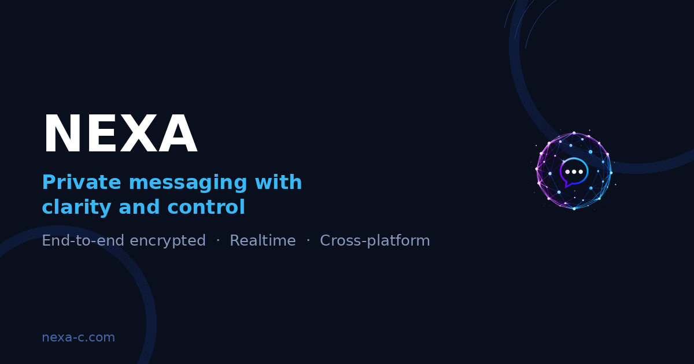

<div align="center">

<br/>

# NEXA

### End-to-end encrypted messenger built for speed, privacy, and scale

<br/>

[](https://nexa-c.com)
[](LICENSE)
[](https://python.org)
[](https://react.dev)
[](https://fastapi.tiangolo.com)
[](https://docker.com)

<br/>



<br/><br/>

</div>

---

## What is Nexa?

Nexa is a **production-grade secure messaging platform** built from the ground up with a microservice architecture, real-time WebSocket infrastructure, and a security-first engineering culture.

Every feature — from end-to-end encrypted messages to ephemeral media to WebRTC voice calls — is designed with privacy and performance as primary constraints, not afterthoughts.

---

## Core Features

<table>
<tr>
<td width="50%">

**Messaging**
- Real-time WebSocket delivery
- End-to-end encryption (E2EE)
- Ephemeral messages with TTL
- Offline message queue with sync
- Voice messages with waveform UI
- File & media sharing

</td>
<td width="50%">

**Security**
- RS256 JWT + refresh rotation
- WebAuthn / passkey login
- OAuth 2.0 (Google, GitHub)
- CSRF protection on every mutation
- HSTS + strict CSP in production
- Brute-force guard + rate limiting

</td>
</tr>
<tr>
<td width="50%">

**Calls & Media**
- WebRTC peer-to-peer voice/video
- Screen sharing
- Resumable uploads (large files)
- S3 / MinIO media storage
- Image gallery with blur-up preview

</td>
<td width="50%">

**Platform**
- Multi-device sessions
- Privacy lock screen + PIN
- Contact requests & blocking
- Stories with view receipts
- Notification centre
- Desktop (Tauri) · Mobile (Expo)

</td>
</tr>
</table>

---

## Architecture

```
┌─────────────────────────────────────────────────────────┐
│               Clients                                   │
│   Web (React 19)  ·  Desktop (Tauri)  ·  Mobile (Expo) │
└──────────────────────┬──────────────────────────────────┘
                       │  HTTPS / WSS
┌──────────────────────▼──────────────────────────────────┐
│                   Nginx (TLS termination)               │
│             HSTS · CSP · Permissions-Policy             │
└──────┬───────────────────────────────┬──────────────────┘
       │  REST                         │  WebSocket
┌──────▼──────┐                 ┌──────▼──────┐
│ api-gateway │                 │ ws-gateway  │
│ rate-limit  │                 │ presence    │
│ CSRF · JWT  │                 │ pub/sub     │
└──────┬──────┘                 └──────┬──────┘
       │                               │
┌──────▼───────────────────────────────▼──────────────────┐
│                  Microservices                          │
│                                                         │
│  auth  ·  user  ·  contact  ·  chat  ·  media          │
│  notification  ·  presence  ·  call  ·  story  ·  ai   │
└──────┬──────────────────────────────────────────────────┘
       │
┌──────▼──────────────────────────────────────────────────┐
│                  Data Layer                             │
│   PostgreSQL (partitioned)  ·  Redis  ·  S3 / MinIO    │
└─────────────────────────────────────────────────────────┘
```

---

## Tech Stack

| Layer | Technology |
|-------|-----------|
| **Web frontend** | React 19, TypeScript, Vite, Zustand |
| **Desktop** | Tauri (Rust + WebView) |
| **Mobile** | Expo / React Native |
| **API gateway** | FastAPI, httpx proxy, JWT middleware |
| **Microservices** | FastAPI, SQLAlchemy 2, asyncpg |
| **Real-time** | WebSocket, Redis pub/sub |
| **Auth** | JWT RS256, WebAuthn, OAuth 2.0, TOTP |
| **Database** | PostgreSQL 16 (per-service schemas) |
| **Cache / queue** | Redis 7 |
| **Media** | S3-compatible (MinIO in dev) |
| **Observability** | OpenTelemetry, Prometheus, Grafana, Jaeger |
| **Infrastructure** | Docker Compose, Nginx, GitHub Actions |
| **Security scanning** | Trivy, Bandit, CodeQL, Gitleaks |

---

## Quick Start

```bash
# 1. Clone and configure
git clone https://github.com/pargevk1996-a11y/Nexa-c.git
cd Nexa-c
cp .env.example .env
# Fill in JWT secrets and DB passwords in .env

# 2. Generate dev TLS certs
make certs

# 3. Start everything
make dev-up

# 4. Run tests
make test
```

| Endpoint | Description |
|----------|-------------|
| `https://localhost` | Full app via Nginx |
| `http://127.0.0.1:5173` | Vite dev server (hot reload) |
| `http://localhost:8025` | Mailpit (email preview) |

---

## Security Design

Nexa is built around the principle of **minimum viable trust** — the server holds as little sensitive data as possible, and what it does hold is protected at every layer.

```
Device ──[E2EE]──► Server ──[at-rest encryption]──► Database
  │                  │
  │              RS256 JWT                    Rate limiting
  │              Refresh rotation             Brute-force guard
  └──[WebAuthn]──► No passwords stored        Audit trail
```

**Key properties:**
- Messages are encrypted client-side before transmission
- Access tokens are short-lived (15 min); refresh tokens are rotated on use
- All cookies are `HttpOnly`, `Secure`, `SameSite=Strict`
- Production enforces HSTS with `preload` and a strict Content Security Policy
- Every mutating API endpoint is CSRF-protected

See [`docs/security/CRYPTO_SPEC.md`](docs/security/CRYPTO_SPEC.md) for full cryptographic design.

---

## Repository Layout

```
Nexa-c/
├── backend/
│   ├── shared/            # nexa_shared — JWT, CSRF, passwords, rate-limit
│   ├── api-gateway/       # Reverse proxy + auth middleware + security headers
│   ├── auth-service/      # Login, register, OAuth, WebAuthn, sessions
│   ├── chat-service/      # Messages, threads, reactions
│   ├── user-service/      # Profiles, avatars, search
│   ├── contact-service/   # Contacts, requests, blocking
│   ├── media-service/     # Upload, transcode, signed URLs
│   ├── ws-gateway/        # WebSocket hub, presence, pub/sub
│   ├── notification-service/
│   ├── call-service/      # WebRTC signalling
│   ├── story-service/
│   └── ai-service/
│
├── frontend/web/          # React 19 web client
├── apps/
│   ├── desktop/           # Tauri desktop wrapper
│   └── mobile/            # Expo mobile app
│
├── infrastructure/
│   ├── nginx/             # TLS, reverse proxy, security headers
│   ├── postgres/          # Migrations (per-service schemas)
│   ├── tls/               # Dev cert generation
│   └── observability/     # Grafana dashboards
│
├── tests/
│   ├── unit/
│   ├── integration/
│   ├── security/          # Auth bypass, rate-limit, CSRF tests
│   ├── websocket/
│   ├── smoke/
│   └── e2e/               # Playwright
│
└── docs/
    ├── security/          # CRYPTO_SPEC, SECURITY_ROADMAP, incident log
    ├── infrastructure/    # ARCHITECTURE
    └── legal/             # PRIVACY_POLICY
```

---

## CI / CD

| Check | Scope |
|-------|-------|
| **Lint** | Ruff (Python), TypeScript build |
| **Unit tests** | pytest — auth, JWT, rate-limit, password policy |
| **Integration** | Session policy, WebSocket gateway |
| **Security** | Bandit (SAST), Trivy (CVE), CodeQL, Gitleaks |
| **E2E** | Playwright (UI flows) |
| **Compose validate** | All docker-compose profiles |
| **Desktop build** | Tauri · Linux / macOS / Windows |

---

## Docs

| Document | Description |
|----------|-------------|
| [`docs/security/CRYPTO_SPEC.md`](docs/security/CRYPTO_SPEC.md) | Cryptographic design & key management |
| [`docs/security/SECURITY_ROADMAP.md`](docs/security/SECURITY_ROADMAP.md) | Security feature timeline |
| [`docs/infrastructure/ARCHITECTURE.md`](docs/infrastructure/ARCHITECTURE.md) | System architecture overview |
| [`docs/nexa/PLATFORM_BLUEPRINT.md`](docs/nexa/PLATFORM_BLUEPRINT.md) | Full platform specification |
| [`docs/nexa/FEATURES.md`](docs/nexa/FEATURES.md) | Feature registry with status |
| [`SECURITY.md`](SECURITY.md) | Vulnerability disclosure policy |

---

<div align="center">

**[nexa-c.com](https://nexa-c.com)** · MIT License

</div>
