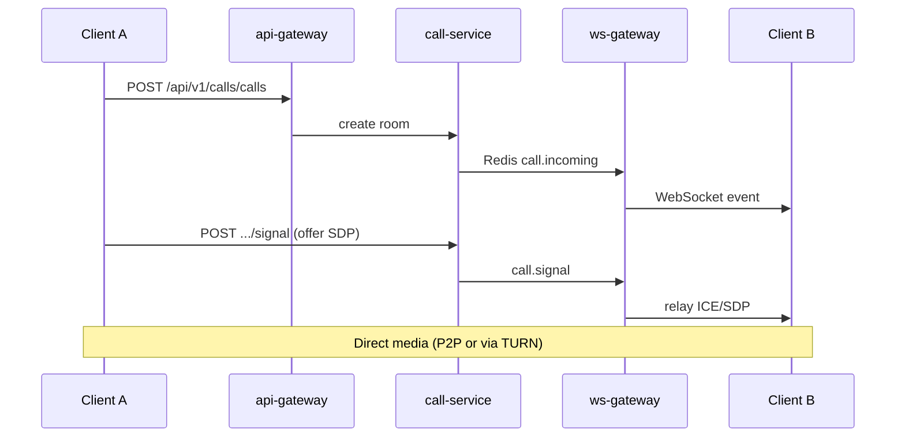

# Nexa — Call System (WebRTC)

Voice/video calls with mesh WebRTC, server-mediated signaling, STUN/TURN, adaptive bitrate, echo cancellation, noise suppression, screen sharing, and group calls (≤8 peers recommended).

## Architecture



| Component | Port | Role |
|-----------|------|------|
| **call-service** | 8011 | Room state, ICE config, signal relay |
| **ws-gateway** | 8009 | Delivers `call.*` events to connected clients |
| **api-gateway** | 8000 | Proxies `/api/v1/calls/*` |

Signaling never carries media. SDP and ICE candidates are relayed through call-service → Redis → ws-gateway.

## Features

| Feature | Implementation |
|---------|----------------|
| Voice calls | `call_type: audio`, audio-only `getUserMedia` |
| Video calls | `call_type: video`, 720p ideal / 1080p max |
| STUN | `GET /api/v1/calls/ice` — public Google STUN by default |
| TURN | Coturn-style HMAC credentials when `TURN_URLS` + `TURN_SECRET` set |
| Adaptive bitrate | Tiered caps (2.5M→400k bps) + `scaleResolutionDownBy`; loss-based degrade/upgrade |
| Camera switching | `switchCamera()` — facingMode flip or device cycle |
| Fullscreen | `CallOverlay` stage `requestFullscreen`; keyboard **f** |
| Group video UI | `CallVideoGrid` — 1/2/2×2/scroll layouts for remote streams |
| Low-latency audio | 48 kHz mono, `bundlePolicy: max-bundle` |
| Echo cancellation | `echoCancellation: true` in media constraints |
| Noise suppression | `noiseSuppression: true`, `autoGainControl: true` |
| Screen sharing | `getDisplayMedia` + `replaceTrack` on all peer connections |
| Group calls | Full mesh: N×(N−1) peer connections; `is_group` when >1 callee |

## API (via gateway)

| Method | Path | Description |
|--------|------|-------------|
| GET | `/api/v1/calls/ice` | ICE servers (STUN + optional TURN creds) |
| POST | `/api/v1/calls/calls` | Start call `{ call_type, participant_ids, conversation_id? }` |
| GET | `/api/v1/calls/calls` | List recent calls for current user |
| POST | `/api/v1/calls/calls/{id}/accept` | Accept incoming |
| POST | `/api/v1/calls/calls/{id}/reject` | Decline |
| POST | `/api/v1/calls/calls/{id}/end` | Hang up |
| POST | `/api/v1/calls/calls/{id}/signal` | Relay SDP/ICE `{ to_user_id, signal_type, sdp?, candidate? }` |

## WebSocket events

| Event | Direction | Payload |
|-------|-----------|---------|
| `call.incoming` | server → client | `call_id`, `call_type`, `caller_id`, `participant_ids`, `is_group` |
| `call.accepted` | server → client | `call_id`, `user_id` |
| `call.rejected` | server → client | `call_id`, `user_id` |
| `call.ended` | server → client | `call_id`, `user_id` |
| `call.signal` | server → client | `from_user_id`, `signal_type`, `sdp`, `candidate` |

Clients may also send `call.signal` on the WebSocket for low-latency relay (ws-gateway publishes to Redis).

## Frontend

| Path | Purpose |
|------|---------|
| `src/calls/CallEngine.ts` | RTCPeerConnection mesh, media, screen share |
| `src/calls/CallProvider.tsx` | React state + WS handler |
| `src/calls/webrtcConfig.ts` | Constraints, bitrate, ICE mapping, `VITE_ICE_SERVERS` |
| `src/calls/CallDemoEngine.ts` | Demo local + mock/loopback media |
| `src/calls/demoCallPeers.ts` | Demo peer ids + labels per conversation |
| `src/components/calls/GlobalCallUi.tsx` | Overlay + incoming banner (app-wide) |
| `src/components/calls/CallVideoGrid.tsx` | Multi-remote video tiles |
| `src/components/chat/CallOverlay.tsx` | Controls, fullscreen, quality badge |
| `src/api/calls.ts` | REST helpers |

Start a call from **Chat** (header phone/video) or **Calls** page (quick dial). Requires a DM with `peer_user_id` from chat-service.

## Configuration

### Backend (call-service)

```bash
# .env
CALL_SERVICE_URL=http://127.0.0.1:8011
STUN_URLS=stun:stun.l.google.com:19302,stun:stun1.l.google.com:19302
TURN_URLS=turn:turn.example.com:3478?transport=udp
TURN_SECRET=your-coturn-static-auth-secret
TURN_TTL_SECONDS=86400
```

For local dev: `make dev-up` starts call-service on port **8011**.

### Frontend (Vite)

Optional client-side ICE override (used when set; otherwise `GET /api/v1/calls/ice`):

```bash
# frontend/web/.env.local
# JSON array:
# VITE_ICE_SERVERS=[{"urls":"stun:stun.l.google.com:19302"},{"urls":"turn:turn.example.com:3478","username":"u","credential":"p"}]
# Or comma-separated URLs:
# VITE_ICE_SERVERS=stun:stun.l.google.com:19302,turn:turn.example.com:3478?transport=udp
```

Parsed in `webrtcConfig.iceServersFromViteEnv()`; merged via `resolveIceServers()` in live and demo engines.

## Demo mode

When `session.demoMode` is true (`CallProviderDemo`):

| Behavior | Detail |
|----------|--------|
| Signaling | None — no call-service or WebSocket required |
| Local media | Real `getUserMedia` (mic/camera permissions) |
| 1:1 video | Loopback `RTCPeerConnection` pair for real adaptive bitrate stats |
| Group / multi | Canvas `captureStream` tiles per peer id (`demoCallPeers.ts` labels) |
| Controls | Same overlay: mute, PTT, camera, screen share, end |

Start from **Chat** header or **Calls** quick dial. **Dev Team** (`c3`) shows three mock tiles; **Alex**/**Maria** use loopback or single mock remote.

## Limitations & next steps

- **In-memory call store** — rooms lost on call-service restart.
- **Mesh topology** — CPU/bandwidth grows O(N²); SFU (LiveKit/mediasoup) for large groups.
- **Group dial from history** — redials all `participant_ids`; labels from IDs until profile API wired.
- **Call history** — list endpoint exists; persist to Postgres in Phase 4b.
- **E2EE calls** — not implemented (would need SFrame/insertable streams).

## Testing (two browsers)

1. Register two users, create a DM between them.
2. Open chat in two profiles/browsers, both logged in.
3. User A clicks video call → User B sees incoming banner → Accept.
4. Verify audio/video; toggle mute, screen share, end call.
5. **Group video** (3 clients): confirm all remotes appear in the grid.
6. **Camera flip**, **fullscreen** (button or **f**), **quality badge** under simulated packet loss.

For NAT-heavy networks, configure TURN and retest.

See also [VIDEO.md](./VIDEO.md) for video messages and call UX details.
