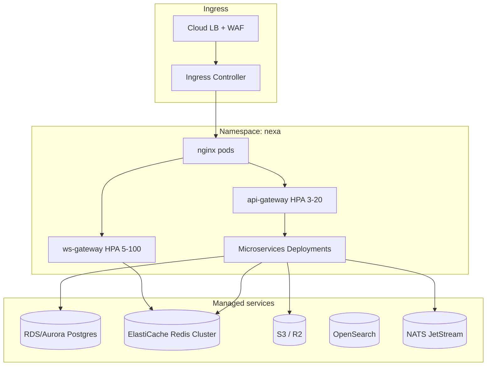

# Nexa — Deployment & Scaling

> Production infrastructure for millions of users, low-latency realtime, and global media delivery.

---

## 1. Environment tiers

| Tier | Stack | Purpose |
|------|-------|---------|
| **Local** | `make dev-up` — uvicorn + Vite, optional local Postgres/Redis | Developer iteration |
| **Dev** | `docker-compose.yml` + Mailpit | Integration testing |
| **Staging** | Compose prod overlay or K8s staging namespace | Pre-release QA |
| **Production** | K8s + managed Postgres + Redis Cluster + S3 + CDN | Live traffic |

---

## 2. Docker Compose (current)

**Files:**

- `docker-compose.yml` — 14 backend services, postgres, redis, nginx, mailpit
- `docker-compose.prod.yml` — restart policies, resource limits, no exposed DB ports

**Services:** auth, user, contact, chat, media, story, emoji, notification, ws-gateway, presence, call, ai, api-gateway, nginx

```bash
make up          # docker compose up -d --build
make prod-up     # with prod overlay
make down
```

**Healthchecks:** each service exposes `GET /health`

---

## 3. Kubernetes target architecture



### Recommended manifests (Phase 6)

```
infrastructure/k8s/
├── base/
│   ├── namespace.yaml
│   ├── configmap-env.yaml
│   ├── secrets.yaml          # ExternalSecrets → Vault
│   └── kustomization.yaml
├── services/
│   ├── api-gateway/
│   ├── ws-gateway/             # HPA on CPU + custom WS connections metric
│   ├── chat-service/
│   └── ...
├── ingress/
│   ├── nginx-ingress.yaml
│   └── cert-manager.yaml
└── monitoring/
    ├── prometheus.yaml
    ├── grafana-dashboards/
    └── loki.yaml
```

### HPA guidelines

| Service | Min | Max | Metric |
|---------|-----|-----|--------|
| ws-gateway | 5 | 100 | active_connections / pod > 10k |
| api-gateway | 3 | 20 | CPU 70% |
| chat-service | 3 | 30 | CPU + queue depth |
| media-service | 2 | 15 | upload queue lag |
| ai-service | 2 | 10 | request latency p95 |

---

## 4. WebSocket scaling

1. **Stateless ws-gateway pods** — no sticky sessions required if Redis registry routes events
2. **Connection registry** — `nexa:ws:conns:{user_id}` → SET of `{node_id}:{conn_id}`
3. **Fan-out** — publish to `nexa:ws:node:{node_id}` for each online member
4. **Cross-region** — Redis Global Datastore or regional pub/sub bridge (Phase 6+)
5. **Backpressure** — per-connection send buffer; drop typing events first

---

## 5. Database scaling

| Pattern | Application |
|---------|-------------|
| **Per-service DB** | Already: auth_db, chat_db, … |
| **Read replicas** | chat-service list/sync reads |
| **Message partitioning** | HASH(conversation_id), 32 partitions |
| **Hot conversation cache** | Redis: last 100 messages per conv |
| **Connection pooling** | PgBouncer between services and Postgres |
| **Archival** | Cold storage for messages > 1 year |

---

## 6. Redis usage

| Key pattern | Purpose | TTL |
|-------------|---------|-----|
| `nexa:ws:conns:{user_id}` | WS routing (SET, multi-tab/device) | session TTL |
| `nexa:presence:{user_id}` | Online status | 60s |
| `nexa:typing:{conv_id}` | Typing set | 10s |
| `nexa:rate:{user_id}` | Rate limit counters | 1m |
| `nexa:mq:retry` | Offline WS retry stream | — |
| `nexa:session:{id}` | Optional session cache | refresh TTL |

**Production:** Redis Cluster, 3+ shards, AOF persistence.

---

## 7. Media & CDN

```
Client → api-gateway → media-service → S3 (encrypted blobs)
Public delivery → signed URL → CDN edge (CloudFront/Cloudflare)
```

- Transcode workers: separate Deployment consuming NATS `media.transcode`
- Image: Pillow sync; video: ffmpeg sidecar
- Cache-Control on CDN: short TTL for signed URLs

---

## 8. Observability

| Signal | Tool |
|--------|------|
| Metrics | Prometheus + Grafana |
| Logs | Loki or ELK, JSON structured |
| Traces | OpenTelemetry → Tempo/Jaeger |
| Alerts | PagerDuty on p99 latency, error rate, WS disconnect spike |
| SLOs | 99.9% API uptime, p99 message delivery < 150ms |

**Required labels:** `service`, `node_id`, `request_id`, `user_id` (hashed)

---

## 9. CI/CD pipeline

```yaml
# .github/workflows/deploy.yml (target)
on:
  push:
    branches: [main]
jobs:
  test:
    - pytest backend/
    - npm test frontend/web
  build:
    - docker buildx bake (all services)
    - push to registry
  deploy:
    - kubectl apply -k infrastructure/k8s/overlays/prod
    - rollout status
```

**Secrets:** Vault / AWS Secrets Manager → K8s ExternalSecrets  
**Migrations:** init container runs Alembic before pod ready

---

## 10. Security at edge

- TLS 1.3 termination at nginx/ingress
- WAF rules: rate limit, geo block, bot detection
- mTLS optional between services (service mesh Istio/Linkerd)
- Network policies: ws-gateway → chat/presence only

See [SECURITY.md](./SECURITY.md)

---

## 11. Disaster recovery

| Component | RPO | RTO | Method |
|-----------|-----|-----|--------|
| Postgres | 5 min | 30 min | PITR + cross-region replica |
| Redis | 1 min | 15 min | Cluster failover |
| S3 media | 0 | 1 hr | Cross-region replication |
| Config | 0 | 5 min | GitOps |

---

## 12. Cost optimization

- WS: scale to zero in dev; min 5 pods prod
- AI: separate pool, spot instances OK
- Media transcode: batch queue, spot workers
- OpenSearch: ultrawarm for old indices

---

See [PLATFORM_SPEC.md](./PLATFORM_SPEC.md) for full platform context.
