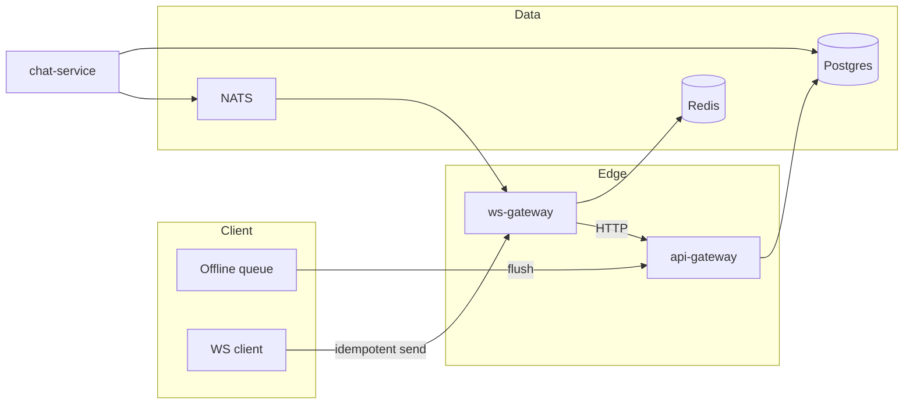

# Nexa — Distributed systems engineering

> Deep dive: bottlenecks, failure modes, and production mitigations.  
> **Blueprint:** [PLATFORM_BLUEPRINT.md](./PLATFORM_BLUEPRINT.md) · **Realtime:** [REALTIME.md](./REALTIME.md) · **DevOps:** [DEVOPS.md](./DEVOPS.md)

---

## 1. Scalability bottlenecks

| Bottleneck | Symptom | Root cause | Mitigation |
|------------|---------|------------|------------|
| **Single chat writer** | Hot partition, lock contention | All messages for `conversation_id` on one row range | Partition by `conversation_id` hash; async write pipeline |
| **WS node fan-out** | CPU spike on popular channels | O(N) connections per event | Shard channels; coalesce typing; Redis pub/sub per node |
| **Redis registry** | Memory + CPU at 1M conns | SET per user grows with devices | TTL heartbeat; cap devices/user; prune stale |
| **Postgres primary** | Replication lag, slow reads | Mixed OLTP + search + analytics | Read replicas; CQRS for search index |
| **Media upload** | Bandwidth saturation | Large files through API gateway | Direct-to-S3 presigned PUT; gateway only signs |
| **Notification burst** | FCM/APNs rate limits | Fan-out on every message | Batching, collapse keys, mute engine |
| **JWT verify at gateway** | CPU on every request | Crypto per hop | Short-lived access token; optional local JWKS cache |
| **In-memory chat store** | Cannot scale replicas | **Current gap** | Postgres repository + idempotent consumers |

---

## 2. Distributed systems problems

### 2.1 Network partitions

- **Client ↔ WS:** Client uses offline queue + `sync?after_seq=` on reconnect ([OFFLINE.md](./OFFLINE.md)).
- **WS ↔ Redis:** Node degrades to local registry only (dev); prod requires Redis HA (Cluster + sentinel).
- **Service ↔ Postgres:** Circuit breaker on pool exhaustion; return `503` + `Retry-After`.

### 2.2 Consistency models

| Data | Model | Rule |
|------|-------|------|
| Message timeline | **Per-conversation total order** | Monotonic `seq` assigned by chat-service |
| Read receipts | Eventual | May lag behind delivery; idempotent upsert |
| Presence | Eventual | TTL 30–120s; not transactional with messages |
| Profile | Strong per user | Single writer `user-service` |

### 2.3 Split brain (WS)

- Each connection registered as `(user_id → node_id:conn_id)` in Redis.
- Fan-out publishes to `nexa:ws:node:{node_id}` only.
- On node crash: connections drop; clients reconnect to LB → another node; stale registry entries expire via TTL.

---

## 3. WebSocket scaling

```
                    ┌─────────────┐
                    │  L4/L7 LB   │  sticky optional (conn_id cookie)
                    └──────┬──────┘
           ┌───────────────┼───────────────┐
           ▼               ▼               ▼
      ws-gateway-1    ws-gateway-2    ws-gateway-N
           │               │               │
           └───────────────┼───────────────┘
                           ▼
                  Redis Cluster (registry + pub/sub)
                           ▲
           ┌───────────────┼───────────────┐
           ▼               ▼               ▼
      chat-service    presence-service   call-service
```

| Parameter | Target |
|-----------|--------|
| Connections / node | 50k (config `WS_MAX_CONNECTIONS_PER_NODE`) |
| Frame rate / conn | 50/s (`per_conn_rate_per_second`) |
| Max frame size | 64 KiB |
| Heartbeat | 25s client ping; registry TTL 3× interval |

**Scale-out:** HPA on CPU + custom metric `nexa_ws_connections`. Add nodes without shared memory — all cross-node via Redis.

**Phase 2:** NATS JetStream for durable fan-out + retry worker (replace best-effort Redis stream `nexa:mq:retry`).

---

## 4. Message ordering

1. Client sends `message.send` with `client_msg_id` (UUID).
2. **chat-service** assigns `seq` inside transaction: `INSERT ... RETURNING seq` per `conversation_id`.
3. Event `message.new` includes `seq`; clients discard duplicates where `seq` already seen.
4. **Sync API:** `GET /conversations/{id}/messages?after_seq=` returns strictly increasing rows.

**Out-of-order WS delivery:** Client sorts by `seq` in memory; gap detection triggers `sync.required`.

---

## 5. Idempotency

| Operation | Key | Storage | TTL |
|-----------|-----|---------|-----|
| `message.send` | `client_msg_id` + `conversation_id` | Redis or PG unique index | 24h |
| `POST /messages` (REST) | `Idempotency-Key` header | Same | 24h |
| Refresh token | `refresh_family_id` | session row | session lifetime |
| Webhook / bot | `delivery_id` | notify dedup table | 7d |

**Response on replay:** Return original `message_id` + `seq` with `200`, not duplicate insert.

---

## 6. Retry storms

| Layer | Policy |
|-------|--------|
| **Client HTTP** | Exponential backoff + jitter; max 5; respect `429 Retry-After` |
| **Client WS** | Reconnect 1s→30s cap; do not replay `message.send` until `message.send.ok` or sync |
| **Service → service** | 3 retries, idempotent GET only; mutations via outbox |
| **Retry worker** | `nexa:mq:retry` stream with max deliveries + DLQ |
| **Thundering herd** | Jitter on reconnect; LB spread; Redis rate limit per IP/user |

**Anti-pattern:** Blind retry on `500` for non-idempotent POST without idempotency key.

---

## 7. Backpressure

| Signal | Action |
|--------|--------|
| WS send buffer full | Drop typing first; queue high-priority `message.send` client-side |
| Server queue depth | `503` on HTTP; WS `error` `SERVER_BUSY` |
| DB pool wait | Shed load: reject new sends, keep reads |
| Redis memory | Evict cache keys; shorten idempotency TTL |

**Client:** Offline queue cap (e.g. 500 msgs); oldest dropped with user warning.

---

## 8. Rate limiting

| Scope | Implementation | Limits (example) |
|-------|----------------|------------------|
| IP (gateway) | Redis sliding window | 300 req/min REST |
| User (gateway) | JWT `sub` | 60 msg/min send |
| WS connection | `RateLimiter` in handler | 50 frames/s |
| Login | `login_protection_service` (Redis) | 3 fails → 10m IP lock; 1 retry; fail → 5m; 3 strikes → reset password |
| Media upload | Per-user daily quota | 2 GB/day |
| AI | `ai-service` rate limiter | 20 req/min |

Return `429` + `error.code: RATE_LIMITED` + `Retry-After`.

---

## 9. Abuse prevention

- Registration: email verify, CAPTCHA (prod), domain blocklist.
- Spam: report → `moderation_engine`; auto-mute; hash blocklist for media.
- Scraping: rate limits on search and profile by uid.
- WS: auth required; max connections per user (e.g. 10 devices).
- Invites: signed deep links with expiry.
- Audit: `audit_log` for auth and admin actions.

---

## 10. GDPR / privacy

| Right | Implementation |
|-------|----------------|
| Access | `GET /auth/account/export` + media manifest |
| Erasure | `POST /auth/account/delete` → 30d soft delete → purge job |
| Portability | JSON export + local vault export (client) |
| Restriction | Account freeze flag; stop processing |
| Minimization | E2EE: server stores ciphertext only |
| Residency | EU tenant flag → EU Postgres/S3 region (T5) |
| DPA | Subprocessor list in legal pack |
| Telemetry | Opt-in analytics; no message content in logs |

**Logging:** Never log message `body`, tokens, or refresh cookies. Trace IDs only.

---

## 11. Observability

| Signal | Tool | Key metrics |
|--------|------|-------------|
| Metrics | Prometheus | `http_requests_total`, `ws_connections`, `message_publish_latency` |
| Traces | OTel → Jaeger | Gateway → chat → WS fan-out |
| Logs | Loki / ELK | JSON structured, `request_id` |
| SLOs | Grafana | WS connect success ≥ 99.9%; delivery p99 < 150ms |
| Alerts | Alertmanager | Error rate, Redis down, PG replication lag |

See [DEVOPS.md](./DEVOPS.md).

---

## 12. Zero-downtime deploys

### 12.1 Blue/green

- Two deployments: `nexa-blue`, `nexa-green`.
- Switch Ingress selector after smoke on green.
- DB migrations: **expand** before switch, **contract** after both colors run new code.

### 12.2 Rolling updates

- `maxUnavailable: 0`, `maxSurge: 25%` for stateless services.
- **ws-gateway:** graceful drain — stop accept, wait 30s, SIGTERM; clients reconnect to other pods.
- **chat-service:** backward-compatible API; feature flags gate new fields.

### 12.3 Feature flags

| Store | Use |
|-------|-----|
| Flipt / LaunchDarkly | Product features (E2EE, AI) |
| Redis hash `flags:{env}` | Emergency kill switches |
| `APP_ENV` + ConfigMap | Infra toggles |

**Rules:** Default off in prod; %-rollout by `user_id` hash; audit flag changes.

---

## 13. Failure mode summary



---

See [PLATFORM_BLUEPRINT.md](./PLATFORM_BLUEPRINT.md) for full structure, APIs, and implementation phases.
