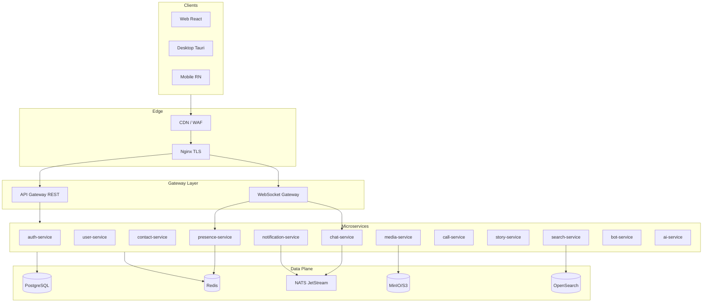
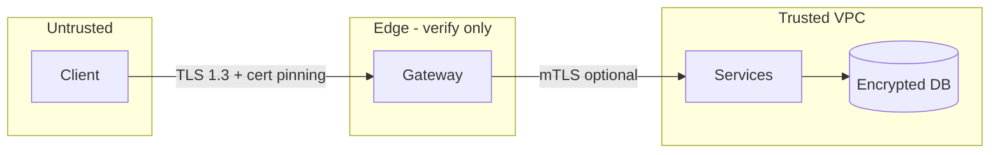
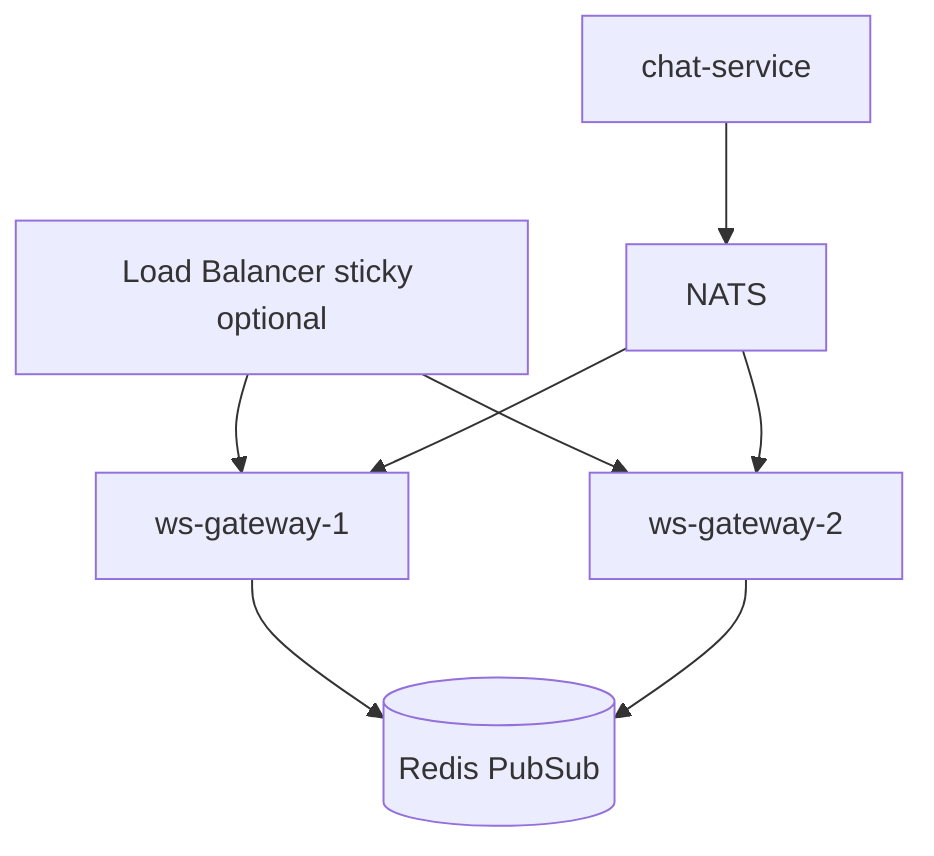

# Nexa — Production Master Plan

> **See also:** [PLATFORM_BLUEPRINT.md](./PLATFORM_BLUEPRINT.md) — **complete** architecture, structure, APIs, security, deploy, scaling, phased plan · [DISTRIBUTED_SYSTEMS.md](./DISTRIBUTED_SYSTEMS.md) · [PRODUCT_VISION.md](./PRODUCT_VISION.md) · [PLATFORM_SPEC.md](./PLATFORM_SPEC.md)

> **Nexa** (working title; replaceable via `BRAND_NAME` env / build-time config)  
> Ultra-secure messenger: Signal-grade privacy + Telegram-grade UX + Discord-grade communities.  
> **Evolution path:** current Nexa monorepo → phased migration, not a rewrite.

---

## 1. Executive summary

| Dimension | Target |
|-----------|--------|
| **Security** | E2EE by default, zero-trust edge, RS256 JWT, refresh rotation + reuse detection, device-bound sessions |
| **Latency** | p99 message delivery < 150ms in-region; optimistic UI < 16ms paint |
| **Scale** | 1M+ concurrent WebSockets per region (horizontally sharded); messages partitioned by `conversation_id` |
| **Clients** | Web (React), Desktop (Tauri), Mobile (React Native), shared `@nexa/sdk` |
| **Ops** | K8s, blue/green, feature flags, full observability (metrics/logs/traces) |

**What exists today (secure-chat):** API gateway, 8 microservices, Postgres per domain DB, Redis, React web UI (mock chat + local vault), OAuth/password auth skeleton, Docker Compose.

**What Nexa adds:** Realtime WS layer, E2EE protocol, durable message store, presence, calls (WebRTC), media pipeline, search, bots, AI sidecar, mobile/desktop clients, production SRE stack.

---

## 2. High-level architecture



### 2.1 Service responsibilities

| Service | Owns | Does NOT own |
|---------|------|----------------|
| **api-gateway** | REST routing, JWT validation, CSRF, rate limits, request ID | Business logic, DB |
| **ws-gateway** | WS auth, fan-out, connection registry, heartbeat | Message persistence |
| **auth-service** | Register/login, 2FA, sessions, refresh rotation, QR login tokens | User profile fields |
| **user-service** | Profile, username, avatar metadata, privacy settings | Messages |
| **contact-service** | Contacts, blocks, invites | Chat membership |
| **chat-service** | Conversations, messages, receipts, pins, edits, E2EE envelope storage | Media bytes |
| **presence-service** | Online, typing, last seen (privacy-aware) | Message content |
| **media-service** | Upload, transcode, CDN URLs, encrypted blobs | Chat logic |
| **notification-service** | Push (FCM/APNs/WebPush), grouping, mute rules | WS delivery |
| **call-service** | WebRTC signaling, TURN creds, room state | Media storage |
| **story-service** | Ephemeral stories, views | Feed algorithm |
| **search-service** | Full-text + semantic index | Primary message store |
| **bot-service** | Bot API, webhooks, inline mode | Human auth |
| **ai-service** | Assistant, moderation, smart reply (opt-in) | Raw E2EE plaintext* |

\* AI only processes **client-decrypted** content with explicit consent, or **metadata-only** moderation signals.

---

## 3. Repository & folder structure

```
nexa/                          # rename from secure-chat when ready
├── apps/
│   ├── web/                   # React + Vite (current frontend/web)
│   ├── desktop/               # Tauri shell → loads web or native views
│   └── mobile/                # React Native + Expo (optional dev client)
├── packages/
│   ├── sdk/                   # @nexa/sdk — API + WS + crypto wrappers
│   ├── crypto/                # E2EE: Signal/MLS bindings, key storage interface
│   ├── ui/                    # shared design system (tokens, components)
│   ├── i18n/                  # localization catalogs
│   └── proto/                 # OpenAPI + WS event schemas (JSON Schema / protobuf)
├── backend/
│   ├── api-gateway/
│   ├── ws-gateway/            # NEW
│   ├── auth-service/
│   ├── user-service/
│   ├── contact-service/
│   ├── chat-service/
│   ├── presence-service/      # NEW (split from chat/redis)
│   ├── media-service/
│   ├── notification-service/
│   ├── call-service/          # NEW
│   ├── story-service/
│   ├── emoji-service/
│   ├── search-service/        # NEW
│   ├── bot-service/           # NEW
│   ├── ai-service/            # NEW
│   └── shared/                # securechat_shared → nexa_shared
├── infrastructure/
│   ├── nginx/
│   ├── postgres/{migrations,init}/
│   ├── redis/
│   ├── nats/
│   ├── minio/
│   ├── k8s/{base,overlays/dev,staging,prod}/
│   ├── terraform/             # cloud IaC
│   └── observability/{prometheus,grafana,loki,tempo}/
├── docs/nexa/                 # this plan + ADRs
├── scripts/
├── .github/workflows/
├── docker-compose.yml
└── Makefile
```

---

## 4. Security model (security-first)

### 4.1 Trust zones



### 4.2 Authentication & sessions

| Mechanism | Implementation |
|-----------|----------------|
| Password hash | **Argon2id** (memory-hard, per-user salt + pepper in KMS) |
| Access token | **JWT RS256**, 15m TTL, `sub`, `sid`, `did` (device id) |
| Refresh token | Opaque random, **HttpOnly Secure SameSite=Lax** cookie + rotation on use |
| Reuse detection | Refresh family ID; reuse revokes all sessions in family |
| 2FA | TOTP + backup codes (hashed), WebAuthn optional phase 2 |
| QR login | Short-lived `qr_session` in Redis; desktop polls; mobile confirms |
| Multi-device | `devices` table per user; session list + revoke in settings |
| Device fingerprint | Hash of UA + platform signals (non-PII); anomaly scoring |

### 4.3 End-to-end encryption

**Phase 1 (MVP):** 1:1 **Signal Protocol** (X3DH + Double Ratchet) via libsignal-client (WASM/native).

**Phase 2:** Groups via **Sender Keys** or **MLS** (RFC 9420) for supergroups.

| Layer | Protection |
|-------|------------|
| Transport | TLS 1.3 everywhere |
| Server storage | Only **ciphertext envelopes** + minimal metadata (conversation_id, timestamps, sender_device_id) |
| Local | IndexedDB / SQLite encrypted with **device master key** (from user passphrase or OS keystore) |
| Media | Per-file AES-GCM key wrapped to recipient device pre-keys |
| Backups | Client-encrypted export; server stores blob only |

**Server NEVER stores:** private keys, group chain keys, message plaintext.

### 4.4 Application security

- **CSRF:** double-submit cookie on gateway mutations  
- **CSP:** strict `default-src 'self'`; nonce scripts in web  
- **XSS:** React escaping + DOMPurify for rich text; no `dangerouslySetInnerHTML` without sanitize  
- **Rate limits:** Redis sliding window per IP + per user + per route  
- **Brute force:** exponential backoff on auth; CAPTCHA after N failures  
- **Audit logs:** append-only `audit_events` (who, what, when, ip_hash)  
- **Media URLs:** short-lived signed URLs; object keys non-guessable  

---

## 5. Database design (PostgreSQL)

### 5.1 Database-per-service (current pattern retained)

| Database | Core tables |
|----------|-------------|
| `auth_db` | users_auth, credentials, sessions, refresh_tokens, totp_secrets, backup_codes, qr_login_sessions, audit_events |
| `user_db` | profiles, usernames, avatars, privacy_settings, user_settings |
| `contact_db` | contacts, blocks, contact_requests |
| `chat_db` | conversations, members, messages, message_edits, reactions, pins, read_receipts, delivery_receipts, scheduled_messages, folders |
| `media_db` | uploads, variants, encryption_wrappers |
| `notify_db` | push_subscriptions, notification_prefs |
| `call_db` | rooms, participants, signaling_events |
| `bot_db` | bots, webhooks, bot_tokens |

### 5.2 `chat_db` schema (excerpt)

```sql
-- conversations: dm | group | channel | supergroup
CREATE TABLE conversations (
  id UUID PRIMARY KEY,
  type TEXT NOT NULL CHECK (type IN ('dm','group','channel','supergroup')),
  title TEXT,
  slug TEXT UNIQUE,              -- public channels
  settings JSONB NOT NULL DEFAULT '{}',
  created_at TIMESTAMPTZ NOT NULL DEFAULT now()
);

CREATE TABLE conversation_members (
  conversation_id UUID REFERENCES conversations(id),
  user_id UUID NOT NULL,
  role TEXT NOT NULL DEFAULT 'member',  -- owner, admin, moderator, member
  permissions BIGINT NOT NULL DEFAULT 0, -- bitmask
  joined_at TIMESTAMPTZ NOT NULL DEFAULT now(),
  PRIMARY KEY (conversation_id, user_id)
);

-- messages: server stores ciphertext + routing metadata only
CREATE TABLE messages (
  id UUID PRIMARY KEY,
  conversation_id UUID NOT NULL REFERENCES conversations(id),
  sender_id UUID NOT NULL,
  sender_device_id UUID NOT NULL,
  client_msg_id TEXT NOT NULL,           -- idempotency from client
  seq BIGINT NOT NULL,                   -- per-conversation monotonic
  envelope BYTEA NOT NULL,               -- E2EE payload
  content_type TEXT NOT NULL,            -- text, media, poll, system
  reply_to_id UUID,
  forward_from_id UUID,
  expires_at TIMESTAMPTZ,
  deleted_for_everyone_at TIMESTAMPTZ,
  created_at TIMESTAMPTZ NOT NULL DEFAULT now(),
  UNIQUE (conversation_id, client_msg_id),
  UNIQUE (conversation_id, seq)
);

CREATE INDEX messages_conv_seq ON messages (conversation_id, seq DESC);
CREATE INDEX messages_conv_created ON messages (conversation_id, created_at DESC);

-- partitioning strategy: RANGE by conversation_id hash or time for archive tables
```

### 5.3 Sharding & scale (phase 3+)

- **Hot path:** `conversation_id` → consistent hash to chat-service shard  
- **History archive:** monthly partitions `messages_YYYY_MM`  
- **Search:** OpenSearch async index via NATS (metadata + client-provided search tokens if E2EE search enabled)  

---

## 6. REST API design

Base: `https://api.nexa.app/v1` (via gateway)

### 6.1 Auth

| Method | Path | Description |
|--------|------|-------------|
| POST | `/auth/register` | Email/username + password (Argon2) |
| POST | `/auth/login` | Returns access JWT + sets refresh cookie |
| POST | `/auth/refresh` | Rotates refresh, new access JWT |
| POST | `/auth/logout` | Revokes session |
| GET | `/auth/sessions` | List active sessions |
| DELETE | `/auth/sessions/{id}` | Revoke device |
| POST | `/auth/2fa/enable` | TOTP setup |
| POST | `/auth/2fa/verify` | Step-up auth |
| POST | `/auth/qr/start` | Desktop: create QR session |
| GET | `/auth/qr/poll` | Desktop: poll until approved |
| POST | `/auth/qr/approve` | Mobile: approve QR |

### 6.2 Users & contacts

| Method | Path | Description |
|--------|------|-------------|
| GET | `/users/me` | Profile |
| PATCH | `/users/me` | Bio, avatar, privacy |
| GET | `/users/search?q=` | Username / id search |
| GET | `/users/{id}` | Public profile card |
| POST | `/contacts` | Add contact |
| GET | `/contacts` | List |
| POST | `/contacts/block` | Block |

### 6.3 Chat

| Method | Path | Description |
|--------|------|-------------|
| GET | `/conversations` | Inbox (cursor pagination) |
| POST | `/conversations` | Create DM/group |
| GET | `/conversations/{id}/messages` | History `?before_seq=&limit=` |
| POST | `/conversations/{id}/messages` | Send (idempotent `client_msg_id`) |
| PATCH | `/messages/{id}` | Edit envelope |
| DELETE | `/messages/{id}` | Delete for me / everyone |
| POST | `/messages/{id}/reactions` | Add reaction |
| POST | `/conversations/{id}/read` | Read receipt up to seq |
| GET | `/conversations/{id}/pins` | Pinned |
| POST | `/messages/search` | Server-assisted search (phase 2) |

### 6.4 Media

| Method | Path | Description |
|--------|------|-------------|
| POST | `/media/uploads` | Initiate multipart upload |
| PUT | `/media/uploads/{id}/parts/{n}` | Chunk |
| POST | `/media/uploads/{id}/complete` | Finalize + virus scan hook |
| GET | `/media/{id}/url` | Short-lived signed download |

### 6.5 Standard error envelope

```json
{
  "error": {
    "code": "RATE_LIMITED",
    "message": "Too many requests",
    "request_id": "01HQ...",
    "details": {}
  }
}
```

---

## 7. WebSocket protocol

**Endpoint:** `wss://api.nexa.app/v1/ws`  
**Auth:** `Sec-WebSocket-Protocol: bearer,<access_jwt>` or first frame `auth` event.

### 7.1 Frame format

```json
{
  "type": "event|ack|rpc",
  "id": "client-correlation-id",
  "name": "message.send",
  "payload": {},
  "ts": 1710000000000
}
```

### 7.2 Server → client events

| Event | Payload summary |
|-------|-----------------|
| `message.new` | conversation_id, message envelope, seq |
| `message.edit` | id, new envelope |
| `message.delete` | id, mode |
| `receipt.delivered` | message_id, user_id, device_id |
| `receipt.read` | up_to_seq, user_id |
| `presence.update` | user_id, status, last_seen? |
| `typing.start` / `typing.stop` | conversation_id, user_id |
| `conversation.updated` | metadata changes |
| `member.joined` / `member.left` | group changes |
| `call.incoming` | room_id, type |
| `notification.push` | silent/data payload |
| `sync.required` | gap detected; client runs REST catch-up |

### 7.3 Client → server events

| Event | Purpose |
|-------|---------|
| `auth` | Initial bind user+device |
| `subscribe` | conversation_ids[] |
| `unsubscribe` | leave rooms |
| `message.send` | realtime send (acks with server seq) |
| `typing` | start/stop |
| `presence.heartbeat` | keepalive |
| `ack` | confirm processed seq |

### 7.4 Delivery guarantees

1. Client assigns `client_msg_id` (UUID).  
2. Server persists → assigns `seq` → publishes to NATS `chat.{conversation_id}`.  
3. WS gateway subscribers receive → fan-out to connected devices.  
4. Client ACKs `message.new`; server marks delivered.  
5. Offline devices: catch up via `GET /messages?after_seq=`.

**Idempotency:** duplicate `client_msg_id` returns original message.

---

## 8. Realtime & scaling strategy

### 8.1 WebSocket horizontal scale



- Connection registry: Redis `HSET ws:conn:{user_id} → {node_id, conn_id}`  
- Fan-out: publish to `ws.node.{node_id}` channel  
- Sticky sessions optional; prefer user-level routing via registry  

### 8.2 Backpressure & abuse

- Per-connection message rate limit (token bucket)  
- Max payload size 64KB per WS frame  
- Slow consumer disconnect  
- Circuit breaker on downstream chat-service  

### 8.3 Caching

| Data | Cache |
|------|-------|
| Session validation | Redis 5m + JWT local verify |
| User profile cards | Redis 1m |
| Conversation list | Client IndexedDB + server cursor |
| Presence | Redis TTL keys |

---

## 9. Media & calls

### 9.1 Media pipeline

1. Client encrypts file → uploads ciphertext chunks  
2. media-service stores in MinIO, records metadata in `media_db`  
3. Worker generates thumbnails (blurhash preview) on encrypted-blind or client-provided thumb  
4. CDN signed URL with 5m TTL  

### 9.2 Calls (WebRTC)

- **call-service** issues TURN/STUN creds (coturn)  
- Signaling over WS (`call.offer`, `call.answer`, `ice`)  
- SFU (livekit/mediasoup) for group calls phase 2  
- Adaptive bitrate via simulcast  

---

## 10. Frontend architecture

### 10.1 Web (evolve current `frontend/web`)

```
src/
├── app/                 # routes, providers
├── features/
│   ├── auth/
│   ├── chat/
│   ├── calls/
│   ├── settings/
│   ├── stories/
│   └── search/
├── components/          # design system
├── stores/              # Zustand slices
│   ├── session.ts
│   ├── inbox.ts
│   ├── activeChat.ts
│   ├── presence.ts
│   └── ui.ts
├── services/
│   ├── api/             # REST client
│   ├── ws/              # reconnect, heartbeat, queue
│   ├── crypto/          # E2EE bindings
│   └── sync/            # offline queue, conflict resolver
├── workers/
│   └── sync.worker.ts   # background sync
└── security/            # existing vault, privacy shield
```

### 10.2 State management (Zustand)

- **Optimistic sends** in `activeChat` with rollback on failure  
- **Normalized entities:** `users`, `conversations`, `messages` by id  
- **Selectors** memoized for virtualized lists (react-window)  

### 10.3 Offline mode

1. Outbox table in IndexedDB (encrypted)  
2. On reconnect: drain outbox in order per conversation  
3. Gap sync: compare `last_seq` with server `sync.required`  

### 10.4 UX layout (Telegram-like)

| Column | Content |
|--------|---------|
| Left | Folders, chat list, search |
| Center | Active thread, composer (floating) |
| Right | Profile / group info (drawer on mobile — already started) |

---

## 11. AI features (opt-in, privacy-preserving)

| Feature | Architecture |
|---------|--------------|
| Smart reply | On-device small model OR server with **decrypted opt-in** per chat |
| Translation | Client-side API key or server proxy with ephemeral processing |
| Moderation | Metadata + hashed fingerprints; optional client-reported ciphertext tags |
| Semantic search | Local index of decrypted messages; optional encrypted search tokens |
| Assistant bot | `ai-service` as special `bot` account; rate-limited |

---

## 12. Bot platform

- **Webhook:** HTTPS POST signed with `X-Nexa-Signature`  
- **Long polling fallback** for dev  
- **Inline bots:** `inline_query` WS/REST event  
- **Mini apps:** sandboxed iframe + `postMessage` bridge + capability tokens  
- **Permissions:** scoped bot tokens (read messages, send, manage group)  

---

## 13. Notifications

| Channel | Stack |
|---------|-------|
| Web | Web Push (VAPID) |
| iOS | APNs via notification-service |
| Android | FCM |
| Desktop | Native + WebPush |

**Grouping:** collapse key = `conversation_id`  
**Silent:** data-only for sync triggers  
**Smart mute:** per-folder, per-conversation, schedule rules  

---

## 14. DevOps & observability

### 14.1 Environments

| Env | Purpose |
|-----|---------|
| `dev` | Docker Compose local |
| `staging` | K8s, feature flags on |
| `prod` | Multi-AZ, auto-scale |

### 14.2 CI/CD pipeline

1. Lint + typecheck (ruff, mypy, eslint, tsc)  
2. Unit tests  
3. Integration tests (Testcontainers: Postgres, Redis, NATS)  
4. SAST (semgrep, trivy)  
5. Build images → push registry  
6. Deploy: ArgoCD rolling / blue-green  
7. Smoke + synthetic WS test  

### 14.3 Observability

| Signal | Tool |
|--------|------|
| Metrics | Prometheus + Grafana dashboards |
| Logs | Loki (structured JSON) |
| Traces | OpenTelemetry → Tempo |
| Alerts | Alertmanager → PagerDuty |
| SLOs | WS connect success, message p99, error rate |

### 14.4 Feature flags

- LaunchDarkly or open-source **Flipt** / flags in Redis  
- Gradual rollout: E2EE, calls, AI  

---

## 15. Testing strategy

| Layer | Tools |
|-------|-------|
| Unit | pytest, vitest |
| Integration | httpx AsyncClient, testcontainers |
| WebSocket | websockets load script, k6 WS scenario |
| E2E | Playwright (web), Detox (mobile) |
| Load | k6 (HTTP + WS), Locust |
| Security | OWASP ZAP, nuclei, fuzzing auth |
| E2EE | libsignal test vectors, cross-client harness |

---

## 16. GDPR & privacy

- Data export API (JSON + media archive)  
- Account deletion: 30-day soft delete → purge job  
- Minimal telemetry; no content analytics without consent  
- DPA-ready subprocessors list  
- Regional data residency (EU shard) phase 3  

---

## 17. Implementation roadmap (phased)

### Phase 0 — Foundation (4–6 weeks) ✅ partial

- [x] Monorepo, gateway, service skeletons, Docker  
- [ ] Rename branding hooks → Nexa  
- [ ] RS256 JWT, refresh rotation, session table  
- [ ] Migrate in-memory auth → Postgres repos  
- [ ] OpenAPI spec + CI codegen  

### Phase 1 — Core messaging (8–10 weeks)

- [ ] `ws-gateway` + NATS  
- [ ] chat_db schema + message CRUD (ciphertext)  
- [ ] Client: real WS, inbox, send/receive, optimistic UI  
- [ ] Delivery & read receipts  
- [ ] Infinite scroll + cursor pagination  
- [ ] E2EE 1:1 (Signal)  

### Phase 2 — Social graph & groups (6–8 weeks)

- [ ] Username search, contacts, blocks  
- [ ] Groups + admin roles + permissions bitmask  
- [ ] Reactions, replies, forwards, edits, deletes  
- [ ] Media upload pipeline  
- [ ] Push notifications  

### Phase 3 — Channels & polish (8 weeks)

- [ ] Channels / broadcast  
- [ ] Pins, folders, saved messages  
- [ ] Stories (existing story-service wired)  
- [ ] Full settings (privacy, devices, export)  
- [ ] Desktop Tauri + mobile RN shell  

### Phase 4 — Calls & realtime scale (6–8 weeks)

- [ ] WebRTC 1:1 + group SFU  
- [ ] Presence/typing at scale  
- [ ] WS sharding, load tests, autoscale policies  

### Phase 5 — Platform (ongoing)

- [ ] Bot API + mini apps  
- [ ] Search (OpenSearch)  
- [ ] AI features (opt-in)  
- [ ] Supergroups, slow mode, moderation  
- [ ] Encrypted backups  

---

## 18. Migration from secure-chat → Nexa

| Current asset | Nexa action |
|---------------|-------------|
| `backend/*-service` | Extend, don't rewrite |
| `api-gateway` proxy | Add WS upgrade route to `ws-gateway` |
| `frontend/web` UI | Keep layout; replace mock ChatContext with real sync |
| `security/*` vault | Align with E2EE key hierarchy |
| `docker-compose` | Add NATS, MinIO, coturn profiles |
| `.env` secrets | Add JWT RSA keys, VAPID, TURN secret |

---

## 19. ADR index (to write)

| ADR | Decision |
|-----|----------|
| ADR-001 | JWT RS256 + opaque refresh |
| ADR-002 | Signal Protocol for 1:1 E2EE |
| ADR-003 | NATS JetStream over Kafka for <10k msg/s |
| ADR-004 | DB-per-service, no shared tables |
| ADR-005 | Ciphertext-only server storage |
| ADR-006 | Zustand over Redux for client state |

---

## 20. Production checklist (go-live gate)

- [ ] TLS 1.3 + HSTS + CSP enforced  
- [ ] Secrets in KMS/Vault, not `.env` in prod  
- [ ] Rate limits on all auth + WS endpoints  
- [ ] Backup + restore drill (Postgres PITR, MinIO versioning)  
- [ ] On-call runbooks: WS storm, DB failover, NATS lag  
- [ ] Pen test remediation complete  
- [ ] SLO dashboards + paging tested  

---

*Document version: 1.0 — aligned with `secure-chat` repo as of 2026-05.*
