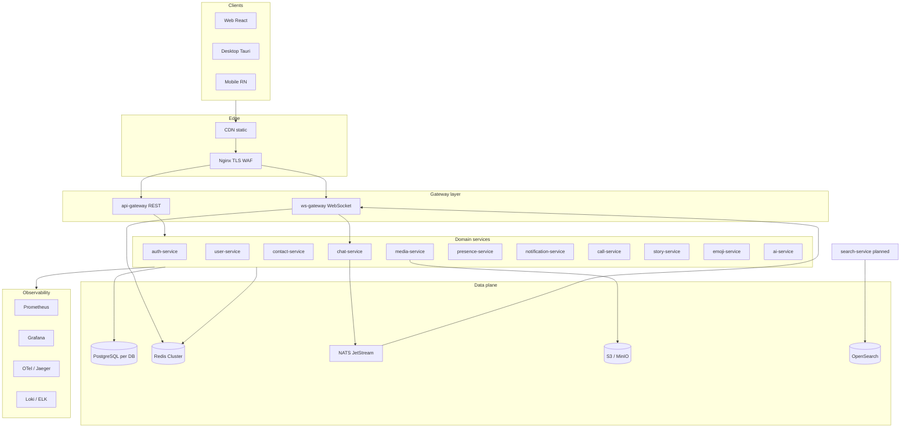
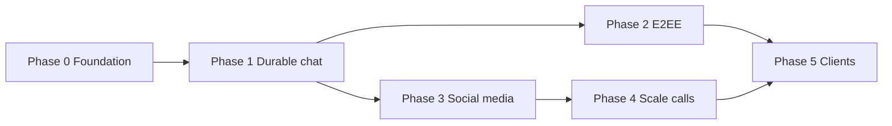

# Nexa — Platform blueprint (complete)

> **Single reference** for architecture, structure, APIs, security, deployment, scaling, and implementation plan.  
> Complements [PLATFORM_SPEC.md](./PLATFORM_SPEC.md) (UI/feature checklist) and [MASTER_PLAN.md](./MASTER_PLAN.md) (historical roadmap).

**Also read:** [DISTRIBUTED_SYSTEMS.md](./DISTRIBUTED_SYSTEMS.md) · [PRODUCTION_BAR.md](./PRODUCTION_BAR.md) · [MATURITY.md](./MATURITY.md)

---

## Table of contents

1. [System architecture](#1-system-architecture)
2. [Folder structure](#2-folder-structure)
3. [Services](#3-services)
4. [Database schema](#4-database-schema)
5. [API design](#5-api-design)
6. [WebSocket events](#6-websocket-events)
7. [Auth flow](#7-auth-flow)
8. [Security model](#8-security-model)
9. [Deployment strategy](#9-deployment-strategy)
10. [Frontend structure](#10-frontend-structure)
11. [Backend structure](#11-backend-structure)
12. [Production considerations](#12-production-considerations)
13. [Scaling strategy](#13-scaling-strategy)
14. [Complete implementation plan](#14-complete-implementation-plan)

---

## 1. System architecture

### 1.1 Logical view



### 1.2 Design principles

| Principle | Enforcement |
|-----------|-------------|
| Bounded context | One Postgres DB per service; no cross-DB FK |
| Gateway-only clients | No direct service ports in production |
| Stateless services | Session in DB/Redis; WS state in registry only |
| Idempotent mutations | `client_msg_id`, `Idempotency-Key` |
| Fail closed | Auth errors never downgrade to anonymous |

---

## 2. Folder structure

```
secure-chat/                          # Nexa monorepo
├── .github/workflows/                # ci.yml, security.yml, deploy-staging.yml
├── backend/
│   ├── shared/securechat_shared/     # JWT, security, realtime, cache, observability
│   ├── api-gateway/app/              # proxy, middleware, config
│   ├── ws-gateway/app/               # ws handler, connection_manager, chat_client
│   ├── auth-service/app/
│   ├── user-service/app/
│   ├── contact-service/app/
│   ├── chat-service/app/             # api, services, db/, schemas
│   ├── media-service/app/
│   ├── notification-service/app/
│   ├── presence-service/app/
│   ├── call-service/app/
│   ├── story-service/app/
│   ├── emoji-service/app/
│   └── ai-service/app/
├── frontend/web/
│   ├── public/                       # sw.js, favicon, nexa-logo
│   └── src/
│       ├── api/                      # REST clients per domain
│       ├── calls/                    # WebRTC, CallProvider
│       ├── components/               # UI by feature (chat, auth, layout, …)
│       ├── hooks/
│       ├── offline/                  # queue, sync, encrypted cache
│       ├── realtime/                 # wsClient, offlineQueue
│       ├── security/                 # vault, bootstrap, privacy seal
│       ├── settings/sections/
│       ├── store/                    # React contexts + zustand
│       ├── styles/
│       └── pages/
├── infrastructure/
│   ├── nginx/
│   ├── postgres/init + migrations/
│   ├── redis/
│   ├── k8s/base + overlays/
│   ├── prometheus/ grafana/ filebeat/
│   └── tls/
├── tests/
│   ├── unit/ integration/ websocket/ security/
│   ├── e2e/                          # Playwright
│   └── load/                         # Locust
├── scripts/                          # dev-up, backup, ci-local, migrations
├── docs/nexa/                        # All product/engineering docs
├── docker-compose.yml
├── docker-compose.staging.yml
├── docker-compose.prod.yml
├── docker-compose.optional.yml       # NATS, MinIO, observability, ELK
├── Makefile
├── requirements-dev.txt
└── AGENTS.md
```

---

## 3. Services

| Service | Port | Database | Owns | Publishes WS |
|---------|------|----------|------|--------------|
| **api-gateway** | 8000 | — | Routing, JWT, CSRF, rate limits | — |
| **auth-service** | 8001 | auth_db | Users, sessions, 2FA, OAuth, WebAuthn | — |
| **user-service** | 8002 | user_db | Profile, username, privacy, presence API | — |
| **contact-service** | 8003 | contact_db | Contacts, blocks, invites | — |
| **chat-service** | 8004 | chat_db | Conversations, messages, seq, receipts | message.*, sync.* |
| **media-service** | 8005 | media_db | Uploads, encrypted blobs, URLs | — |
| **story-service** | 8006 | story_db | Stories, views | story.* |
| **emoji-service** | 8007 | emoji_db | Custom emoji packs | — |
| **notification-service** | 8008 | notification_db | Push, mute, grouping | — |
| **ws-gateway** | 8009 | — | WS auth, fan-out, registry | all inbound WS |
| **presence-service** | 8010 | — | Online, typing | presence.*, typing.* |
| **call-service** | 8011 | call_db | WebRTC rooms, TURN | call.* |
| **ai-service** | 8012 | — | Smart reply, search assist | — |

**Inter-service calls:** HTTP internal mesh (mTLS in prod) or gateway-only from outside.

---

## 4. Database schema

**Executable migrations:** `infrastructure/postgres/migrations/{auth,chat,user,notification}_db/`

**Summary (per DB):**

| DB | Core tables |
|----|-------------|
| **auth_db** | `users`, `sessions`, `totp_secrets`, `oauth_identities`, `qr_login_sessions`, `audit_log` |
| **user_db** | `profiles`, `privacy_settings`, `verification_badges` |
| **contact_db** | `contacts`, `blocks`, `invites` |
| **chat_db** | `conversations`, `conversation_members`, `messages` (partitioned), `message_reactions`, `pinned_messages`, `read_state` |
| **media_db** | `media_objects`, `upload_sessions` |
| **notification_db** | `device_tokens`, `notification_prefs`, `delivery_log` |
| **call_db** | `calls`, `call_participants`, `signaling_events` |

**Message row (canonical):**

```sql
-- chat_db.messages (partitioned by HASH(conversation_id))
conversation_id   UUID NOT NULL,
seq               BIGINT NOT NULL,        -- monotonic per conversation
client_msg_id     UUID,                   -- idempotency
sender_id         UUID NOT NULL,
content_type      TEXT NOT NULL,
body_ciphertext   BYTEA,                  -- E2EE envelope or plaintext policy
body_preview      TEXT,                   -- optional server-side for non-E2EE
created_at        TIMESTAMPTZ NOT NULL,
edited_at         TIMESTAMPTZ,
deleted_at        TIMESTAMPTZ,
PRIMARY KEY (conversation_id, seq)
```

Full DDL: [DATABASE_SCHEMA.md](./DATABASE_SCHEMA.md) · [DATABASE.md](./DATABASE.md)

---

## 5. API design

### 5.1 Conventions

| Rule | Value |
|------|-------|
| Base path | `/api/v1/{domain}/…` via gateway |
| Versioning | URL path `v1`; breaking → `v2` |
| Auth | `Authorization: Bearer {access_jwt}` |
| Mutations | CSRF header + cookie when enabled |
| Errors | `{ "error": { "code", "message", "details?" } }` |
| Pagination | `cursor` + `limit` (max 100) |
| Idempotency | `Idempotency-Key` on POST send |

### 5.2 Domain route map

```
/api/v1/auth/*           → auth-service
/api/v1/users/*          → user-service
/api/v1/contacts/*       → contact-service
/api/v1/chat/*           → chat-service   (conversations, messages, sync)
/api/v1/media/*          → media-service
/api/v1/presence/*       → presence-service
/api/v1/notifications/*  → notification-service
/api/v1/calls/*          → call-service
/api/v1/stories/*        → story-service
/api/v1/ai/*             → ai-service
```

### 5.3 Example: send message (REST fallback)

```http
POST /api/v1/chat/conversations/{id}/messages
Idempotency-Key: 550e8400-e29b-41d4-a716-446655440000
Authorization: Bearer …

{
  "client_msg_id": "550e8400-e29b-41d4-a716-446655440000",
  "content_type": "text",
  "body": "Hello",
  "reply_to_id": null
}

→ 201
{
  "id": "…",
  "conversation_id": "…",
  "seq": 42,
  "created_at": "2026-05-25T12:00:00Z"
}
```

### 5.4 Sync

```http
GET /api/v1/chat/conversations/{id}/messages?after_seq=41&limit=50
GET /api/v1/chat/inbox?updated_after=2026-05-25T00:00:00Z
```

---

## 6. WebSocket events

**Endpoint:** `wss://{host}/api/v1/ws`  
**Spec:** [WS_PROTOCOL.md](./WS_PROTOCOL.md)

### 6.1 Client → server (summary)

| Event | Purpose |
|-------|---------|
| `auth` | JWT handshake |
| `subscribe` / `unsubscribe` | Conversation fan-in filter |
| `message.send` | Primary send path |
| `typing` | Typing indicators |
| `presence.heartbeat` | Keepalive + online |
| `ping` | RTT / keepalive |
| `call.signal` | WebRTC signaling |

### 6.2 Server → client (summary)

| Event | Purpose |
|-------|---------|
| `message.new` / `message.edit` / `message.delete` | Timeline updates |
| `receipt.delivered` / `receipt.read` | Receipts |
| `typing.start` / `typing.stop` | Typing |
| `presence.update` | Online/offline |
| `call.incoming` / `call.ended` | Calls |
| `sync.required` | Gap / corruption heal |
| `error` | Recoverable failures |

### 6.3 Ordering contract

- Server assigns authoritative `seq`.
- Client dedupes by `(conversation_id, seq)` and `client_msg_id`.
- Gap → `GET sync` + `sync.required`.

---

## 7. Auth flow

```mermaid
sequenceDiagram
  participant C as Client
  participant G as api-gateway
  participant A as auth-service
  participant DB as auth_db

  C->>G: POST /auth/login {email, password}
  G->>A: proxy
  A->>DB: verify user, create session
  A-->>C: access_token + Set-Cookie refresh
  Note over C: Store access in memory; refresh HttpOnly

  C->>G: GET /users/me (Bearer access)
  G->>G: verify JWT RS256
  G->>A: or user-service

  C->>G: POST /auth/refresh (cookie)
  A->>DB: rotate refresh, detect reuse
  A-->>C: new access_token

  C->>WS: connect + auth frame {token}
  WS->>WS: verify JWT, register Redis
  WS-->>C: auth.ok
```

| Flow | Endpoints |
|------|-----------|
| Register | `POST /auth/register` → verify email |
| Login + 2FA | `POST /auth/login` → `POST /auth/login/2fa` |
| OAuth | `GET /auth/oauth/{provider}` → callback |
| WebAuthn | login/register start/finish |
| QR device | `POST /auth/qr/start`, poll, approve |
| Logout | `POST /auth/logout` revokes session |
| Revoke device | `DELETE /auth/sessions/{id}` |

Details: [AUTH.md](./AUTH.md)

---

## 8. Security model

### 8.1 Layers

```
┌─────────────────────────────────────────┐
│ Client: E2EE (Signal-style) optional    │
│ Vault: AES-GCM local chat cache         │
├─────────────────────────────────────────┤
│ Transport: TLS 1.3, cert pinning (mob)  │
├─────────────────────────────────────────┤
│ Edge: WAF, DDoS, geo block              │
├─────────────────────────────────────────┤
│ Gateway: JWT, CSRF, rate limit, CSP     │
├─────────────────────────────────────────┤
│ Services: RBAC, conversation ACL        │
├─────────────────────────────────────────┤
│ Data: encryption at rest, row ACL       │
└─────────────────────────────────────────┘
```

### 8.2 Token model

| Token | Lifetime | Storage |
|-------|----------|---------|
| Access JWT | 15 min | Memory / short-lived |
| Refresh | 7–30 d | HttpOnly Secure cookie |
| WS | Access JWT | Subprotocol or auth frame |

**Claims:** `sub`, `sid`, `email`, `typ`, `dfp` (device fingerprint)

**Rotation:** Refresh family ID; reuse detection revokes all sessions.

### 8.3 Threat controls

| Threat | Control |
|--------|---------|
| Credential stuffing | Brute-force guard, 2FA |
| Session hijack | DFP binding, short access TTL |
| XSS | CSP, no tokens in localStorage |
| CSRF | Double-submit cookie |
| Spam | Rate limits, report, blocks |
| MITM | TLS + optional pinning |

Full: [SECURITY.md](./SECURITY.md)

---

## 9. Deployment strategy

### 9.1 Environments

| Env | Compose / K8s | Data |
|-----|---------------|------|
| Local | `make dev-up` | Docker PG/Redis or embedded |
| Dev | `docker-compose.yml` + Mailpit | Named volumes |
| Staging | `docker-compose.staging.yml` | Isolated secrets |
| Production | K8s + managed services | Multi-AZ |

### 9.2 Zero-downtime

| Technique | Applies to |
|-----------|------------|
| **Rolling update** | api-gateway, chat-service, user-service, … |
| **Blue/green** | Full stack cutover after smoke |
| **Canary** | 5% traffic on new WS build (Ingress weight) |
| **DB expand/contract** | Migrations compatible with N and N-1 |

### 9.3 WS drain procedure

1. Pod marked `terminating` → stop accepting upgrades.
2. Existing sockets: 30s grace, then close `1001 Going Away`.
3. Clients reconnect to other pods (LB).
4. Registry TTL removes stale entries.

### 9.4 Feature flags

```yaml
# Example Flipt flag
e2ee_default:
  enabled: false
  rollout: 5%  # hash(user_id)
```

| Flag | Owner |
|------|-------|
| `e2ee_default` | Security |
| `virtualized_inbox` | Frontend |
| `nats_fanout` | Platform |
| `ai_smart_reply` | AI |

Kill switch in Redis: `FLAGS:global:ws_enabled`.

Details: [DEPLOYMENT.md](./DEPLOYMENT.md) · [DEVOPS.md](./DEVOPS.md)

---

## 10. Frontend structure

```
src/
├── api/              # auth.ts, chat.ts, users.ts, …
├── pages/            # route-level screens
├── components/
│   ├── layout/       # AppShell, SideNav, BootstrapScreen
│   ├── chat/         # MessageList, Composer, sidebars
│   ├── auth/
│   ├── calls/
│   └── settings/
├── store/
│   ├── ChatContext.tsx
│   ├── zustand/      # sessionStore, realtimeStore, offlineStore
│   └── SettingsContext.tsx
├── realtime/         # wsClient, types
├── offline/          # encryptedCache, queuedSend, conflictResolution
├── security/         # chatVault, bootstrap
├── hooks/
└── styles/           # tokens → design-system → feature CSS
```

| Concern | Pattern |
|---------|---------|
| State | Context for chat; Zustand for session/realtime |
| Routing | React Router, ProtectedRoute |
| Offline | IDB queue + SW cache |
| Theming | CSS variables + `data-theme` |

Full: [FRONTEND_ARCHITECTURE.md](./FRONTEND_ARCHITECTURE.md)

---

## 11. Backend structure

**Per service:**

```
backend/{service}/app/
├── main.py           # FastAPI app, lifespan, health
├── core/
│   ├── config.py     # pydantic-settings
│   ├── deps.py       # get_current_user_id
│   └── database.py   # async engine (when wired)
├── api/
│   └── routes.py     # routers
├── schemas/          # Pydantic request/response
├── services/         # business logic, stores
└── db/               # SQLAlchemy models (chat-service)
```

**Shared library:**

```
securechat_shared/
├── security/         # jwt, passwords, brute_force, audit
├── realtime/         # events, bus, registry
├── observability/    # setup_observability
├── cache/
└── schemas/
```

Full: [BACKEND_ARCHITECTURE.md](./BACKEND_ARCHITECTURE.md)

---

## 12. Production considerations

| Area | Requirement |
|------|-------------|
| **Secrets** | Vault / K8s ExternalSecrets; rotate quarterly |
| **TLS** | Let’s Encrypt or ACM; HSTS preload |
| **CORS** | Allowlist origins only |
| **Backups** | `make backup-db`; PITR on RDS |
| **DR** | RTO 4h, RPO 15m — [DEVOPS.md](./DEVOPS.md) |
| **Compliance** | GDPR export/delete — settings + auth routes |
| **SLO** | 99.9% API; 99.95% WS connect |
| **Capacity** | Load test gates in CI (Locust) before major releases |
| **Dependencies** | Dependabot + Trivy + CodeQL |
| **Runbooks** | Redis down, PG failover, WS memory leak |

**Never in prod:** `AUTO_VERIFY_EMAIL`, demo mode, HS256 without rotation, exposed Postgres port.

---

## 13. Scaling strategy

### 13.1 Phase map

| Phase | Users (concurrent WS) | Architecture |
|-------|----------------------|--------------|
| **T3** (now) | 1k | Compose, 1–3 WS nodes, Redis single |
| **T4** | 100k | K8s HPA, Redis Cluster, PG replicas, NATS |
| **T5** | 1M+ | Regional shards, WS dedicated AZ, read path CQRS |

### 13.2 Horizontal scale units

| Component | Scale trigger | Action |
|-----------|---------------|--------|
| ws-gateway | `connections > 40k/node` | Add pods |
| api-gateway | CPU > 60% | HPA 3–20 |
| chat-service | DB CPU / write latency | Shard conversations; read replicas |
| media-service | Egress bandwidth | CDN + presigned uploads |
| notification | Queue depth | Worker pool |

### 13.3 Data scale

- **Messages:** HASH partition 64–256 partitions; archive > 1y to cold storage.
- **Search:** OpenSearch async index from NATS.
- **Media:** S3 lifecycle → Glacier.

### 13.4 Multi-region (T5)

- EU + US cells; users pinned by `tenant_region`.
- Cross-region: async replication for public channels only; DMs stay regional.

---

## 14. Complete implementation plan

### Phase 0 — Foundation (weeks 1–6) 🟡

| # | Task | Owner | Exit |
|---|------|-------|------|
| 0.1 | RS256 JWT + session Postgres repo | auth | No in-memory users in prod |
| 0.2 | OpenAPI publish + codegen TS client | platform | `frontend/web/src/api/generated` |
| 0.3 | CI green: lint, 36+ pytest, Playwright | platform | `make ci-local` |
| 0.4 | Staging compose + secrets template | ops | `make staging-up` |

### Phase 1 — Durable messaging (weeks 7–16)

| # | Task | Exit |
|---|------|------|
| 1.1 | chat_db repository (messages, seq) | Send/read via PG |
| 1.2 | Idempotency table/redis | Duplicate `client_msg_id` safe |
| 1.3 | NATS JetStream fan-out | Replace fire-and-forget only |
| 1.4 | WS `read.up_to`, `receipt.*` wired | Protocol complete |
| 1.5 | Client: remove mock-first path for logged-in users | Live-only inbox |
| 1.6 | Virtualized MessageList | 10k scroll perf test |

### Phase 2 — E2EE + security hardening (weeks 17–24)

| # | Task | Exit |
|---|------|------|
| 2.1 | libsignal (or custom) 1:1 secret chats | Ciphertext in `body_ciphertext` |
| 2.2 | Device prekeys + session setup UX | Cross-device sync policy doc |
| 2.3 | Sealed sender metadata minimization | Server cannot read sender on envelope |
| 2.4 | Security audit + pen test fixes | Report published |

### Phase 3 — Social + media (weeks 25–32)

| # | Task | Exit |
|---|------|------|
| 3.1 | contact_db repos + search | Blocks sync to chat ACL |
| 3.2 | media presigned S3 + CDN | Gateway not in data path |
| 3.3 | notification push production | FCM/APNs/WebPush |
| 3.4 | Groups RBAC enforcement | Moderation + permissions |

### Phase 4 — Scale + calls (weeks 33–40)

| # | Task | Exit |
|---|------|------|
| 4.1 | K8s prod overlays all services | `kubectl apply -k prod` |
| 4.2 | WS HPA + drain lifecycle | Load test 50k conns |
| 4.3 | WebRTC SFU path (group calls) | call-service + TURN |
| 4.4 | Blue/green deploy automation | Zero-downtime release doc |

### Phase 5 — Clients + platform (weeks 41–52)

| # | Task | Exit |
|---|------|------|
| 5.1 | Tauri desktop shell | Shared `@nexa/sdk` |
| 5.2 | React Native MVP | Push + E2EE |
| 5.3 | OpenSearch message search | < 200ms query p95 |
| 5.4 | Feature flags (Flipt) all risky features | % rollout in staging |

### Dependency graph



### Success metrics (T4 exit)

| Metric | Target |
|--------|--------|
| Message delivery p99 | < 150 ms in-region |
| WS connect success | ≥ 99.9% |
| Offline sync after 24h | 100% eventual delivery |
| Zero-downtime deploy | 0 user-visible errors in canary |
| GDPR delete | < 30 days full purge |

---

## Quick links

| Topic | Document |
|-------|----------|
| Distributed systems depth | [DISTRIBUTED_SYSTEMS.md](./DISTRIBUTED_SYSTEMS.md) |
| WS protocol | [WS_PROTOCOL.md](./WS_PROTOCOL.md) |
| DB DDL | [DATABASE_SCHEMA.md](./DATABASE_SCHEMA.md) |
| Auth API | [AUTH.md](./AUTH.md) |
| Deploy | [DEPLOYMENT.md](./DEPLOYMENT.md) |
| Tests | [TESTING.md](./TESTING.md) |
| Features status | [FEATURES.md](./FEATURES.md) |
