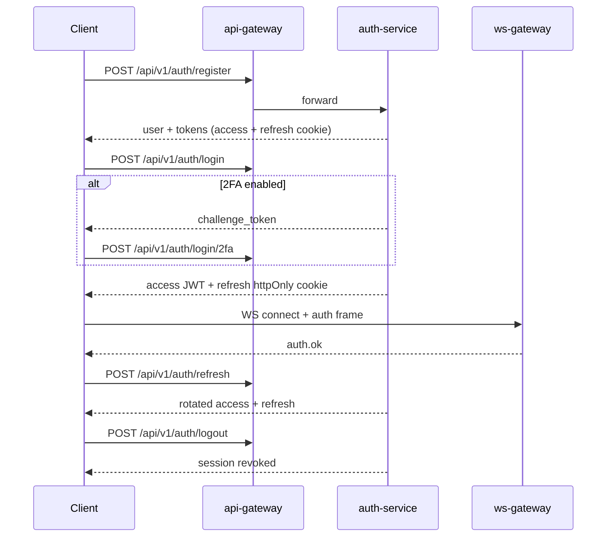

# Nexa — Platform Specification

> **Ultra-fast · Realtime · Minimalistic · Scalable · Secure · Production-ready**  
> Telegram-style UX + Signal-grade security. This document is the single source of truth for architecture, UI, API, realtime, database, deployment, and implementation status.

**Related docs:** [PLATFORM_BLUEPRINT.md](./PLATFORM_BLUEPRINT.md) · [DISTRIBUTED_SYSTEMS.md](./DISTRIBUTED_SYSTEMS.md) · [PRODUCT_VISION.md](./PRODUCT_VISION.md) · [MASTER_PLAN.md](./MASTER_PLAN.md) · [FEATURES.md](./FEATURES.md) · [FRONTEND_ARCHITECTURE.md](./FRONTEND_ARCHITECTURE.md) · [BACKEND_ARCHITECTURE.md](./BACKEND_ARCHITECTURE.md) · [DATABASE_SCHEMA.md](./DATABASE_SCHEMA.md) · [WS_PROTOCOL.md](./WS_PROTOCOL.md) · [DEPLOYMENT.md](./DEPLOYMENT.md) · [SECURITY.md](./SECURITY.md)

---

## 1. Core concept

> Full product north star: [PRODUCT_VISION.md](./PRODUCT_VISION.md)

| Principle | Target | Implementation |
|-----------|--------|----------------|
| Ultra-fast | p99 delivery < 150ms in-region | WS + optimistic UI + Redis fan-out |
| Realtime | Instant delivery, typing, presence | `ws-gateway`, `presence-service` |
| Minimalistic | Clean typography, generous whitespace | CSS tokens in `chat.css`, glass panels |
| Scalable | 1M+ WS/region, partitioned messages | Horizontal WS nodes, Redis pub/sub (→ NATS) |
| Secure | E2EE-ready, zero-trust edge | JWT RS256, CSRF, rate limits, encrypted media |
| Smooth | 60fps scroll, micro-interactions | Virtualized list (planned), skeleton loaders |
| Responsive | Mobile-first, desktop resizable | `ResizableChatShell`, breakpoints |
| Production-ready | Docker, healthchecks, observability | Compose + prod overlay (K8s planned) |

### UX requirements

- Feels **instant** — optimistic sends paint in < 16ms
- **Premium** messenger aesthetic — dark/light, accent violet, glass blur
- **No lag** — lazy media, debounced search, WS reconnect with offline queue
- **Clean typography** — system font stack, 14–16px body, tabular nums for time
- **Minimalist spacing** — 4px grid, 12/16/24px rhythm

---

## 2. UI structure — Telegram-style layout

```
┌─────────────────────────────────────────────────────────────────────────┐
│ TopNav (brand, global search shortcut ⌘K)                               │
├──────────┬──────────────────────────────────────────────┬───────────────┤
│ SideNav  │  LEFT PANEL (sidebar)     │  CENTER (main)   │ RIGHT PANEL   │
│ icons    │  ─────────────────────    │  ─────────────   │ (profile)     │
│          │  Stories bar (planned)    │  ChatHeader      │ Avatar, bio   │
│ Chats    │  Search input             │  Typing bar      │ Shared media  │
│ Contacts │  Pinned section           │  MessageList     │ Members       │
│ Calls    │  Folders (planned)        │  Selection bar   │ Group settings│
│ Settings │  Chat list + unread       │  Composer        │ Pinned msgs   │
│          │  Archived (planned)       │  AI panels       │ Notifications │
└──────────┴──────────────────────────────────────────────┴───────────────┘
```

### Panel mapping (current code)

| Zone | Component | Path |
|------|-----------|------|
| App shell | `AppShell`, `SideNav`, `TopNav` | `frontend/web/src/components/layout/` |
| Left panel | `ChatLeftPanel` + `ChatSidebar` | `components/chat/ChatLeftPanel.tsx` |
| Center | `ChatHeader`, `MessageList`, `MessageComposer` | `pages/ChatPage.tsx` |
| Right panel | `ProfilePanel` (slide-over / resizable) | `components/chat/ProfilePanel.tsx` |
| Resizable | `ResizableChatShell`, `ResizeHandle` | `utils/panelLayout.ts` |
| Global calls | `GlobalCallUi` | `components/calls/GlobalCallUi.tsx` |

### Left panel — checklist

| Feature | Status | Notes |
|---------|--------|-------|
| Chat list | ✅ | `ChatSidebar`, API + mock fallback |
| Search | ✅ | Filter by name/uid in sidebar |
| Pinned chats | ✅ | Pin/unpin via context menu; pinned section in sidebar |
| Folders | ✅ | Personal / Work / Teams / Channels in `ChatLeftPanel` |
| Chat type categories | ✅ | All / Private / Secret / Groups / Channels / Saved pills |
| Unread counters | ✅ | `unread_count` from API |
| Archived chats | ✅ | Archive/unarchive + expandable archived section |
| Hidden chats | ✅ | Hide/unhide + expandable hidden section |
| Saved Messages | ✅ | Always in vault; dedicated sidebar section |
| Chat type badges | ✅ | `ChatTypeBadge` in list + header pill |
| Broadcast channels | ✅ | Read-only composer when `canPost` is false |
| Supergroups | ✅ | Member count + supergroup badge in header |
| Secret chats | ✅ | Secret category + E2EE composer restrictions |
| Pinned chats | ✅ | (see above) — pin/unpin context actions |
| Stories bar | ✅ | `StoryStrip` in left panel on `/app/chats` |
| Profile section | ✅ | Footer profile + full `ProfilePanel` |
| Settings shortcut | ✅ | Left panel footer + SideNav |

### Center panel — checklist

| Feature | Status | Notes |
|---------|--------|-------|
| Message history | ✅ | `MessageList`, seq-ordered |
| Date separators | ✅ | `chat-date-divider` |
| Typing indicators | ✅ | WS `typing.*` + header bar |
| Message grouping | ✅ | `buildMessageRows` grouped bubbles + tail |
| Reactions | ✅ | Emoji reactions API |
| Replies / forwards | ✅ | `reply_to_id`, `forward_from_id` |
| Media preview | ✅ | `FileMessage`, `LazyMediaImage` |
| Stickers / GIFs | 🟡 | Demo picker only |
| Voice messages | 🟡 | `VoiceRecorder` UI |
| Video messages | ✅ | VideoMessage + media transcode |
| Inline media player | 🟡 | `MediaViewer` |
| Selection mode | ✅ | `MessageSelectionBar` |
| Smooth scroll | ✅ | `MessageList` near-bottom detect |
| Lazy loading | ✅ | IntersectionObserver loads older slice; `LazyMediaImage` |

### Right panel — checklist

| Feature | Status | Notes |
|---------|--------|-------|
| Profile info | ✅ | `ProfilePanel` |
| Shared media | ✅ | Profile tab — files from history + placeholders |
| Members list | ✅ | Profile tab for groups |
| Group settings | 🟡 | Profile tab placeholder (API: `SpaceAdminPanel`) |
| Notification settings | ✅ | Profile Alerts tab toggles |
| Pinned messages | ✅ | Profile Pinned tab from message history |

### Composer — checklist

| Feature | Status | Notes |
|---------|--------|-------|
| Text input | ✅ | `MessageComposer` |
| Emoji picker | ✅ | `EmojiPicker` |
| Stickers / GIF | 🟡 | Demo data |
| Attachments | ✅ | `FileAttachButton` + media API |
| Voice record | ✅ | `VoiceRecorder` |
| Send | ✅ | Enter-to-send setting |
| Edit mode | ✅ | Edit banner + save |
| Reply preview | ✅ | Composer banner + quote in bubbles |
| AI smart reply | ✅ | `SmartReplyBar` |
| Voice-to-text | ✅ | `Aa` toggle + `ai/transcribe` |

---

## 3. Component system

### Design tokens

```css
/* frontend/web/src/styles/chat.css + theme vars */
--bg-base, --bg-elevated, --bg-input
--text, --text-muted, --accent (#a78bfa)
--radius-sm/md/lg/xl/full, --shadow-md
--header-h, --sidebar-w (resizable)
```

### Layer architecture

```
pages/          → route-level composition (ChatPage, SettingsPage)
components/
  layout/       → AppShell, SideNav, TopNav, ResizeHandle
  chat/         → messaging UI (list, composer, header, sidebar)
  ai/           → assistant, search, smart reply
  calls/        → overlay, global UI
  groups/       → spaces admin, create modal
  auth/         → login, register, OAuth
  ui/           → Avatar, Button, IconButton, fields
store/          → ChatContext, SettingsContext (React context)
api/            → typed REST clients (apiFetch + CSRF)
realtime/       → wsClient, sync, useRealtimeChat, offlineQueue
calls/          → CallEngine, CallProvider, webrtcConfig
ai/             → useSmartReply hooks
security/       → session, CSRF, E2EE stub, vault
features/       → registry.ts feature flags
```

### Animation guidelines

| Interaction | Animation | Status |
|-------------|-----------|--------|
| Panel resize | CSS width transition | ✅ |
| Message send | Fade-in bubble (planned) | ⬜ |
| Typing dots | CSS keyframes | ✅ |
| Modal open | Scale + fade | 🟡 |
| Skeleton load | Shimmer placeholder | ⬜ |
| Story viewer | Progress bar loop | ✅ |

---

## 4. Frontend routes

| Path | Page | Auth |
|------|------|------|
| `/login`, `/register` | Auth | Guest |
| `/oauth/callback` | OAuth | Guest |
| `/app/chats` | Main messenger | Protected |
| `/app/contacts` | Contacts | Protected |
| `/app/calls` | Call history + dial | Protected |
| `/app/settings` | Appearance, privacy, security | Protected |
| `/app/posts` | Social feed (experimental) | Protected |

---

## 5. Backend architecture

### Service map (ports)

| Service | Port | Gateway key | Status |
|---------|------|-------------|--------|
| api-gateway | 8000 | — | ✅ |
| auth-service | 8001 | `auth` | ✅ |
| user-service | 8002 | `users` | ✅ |
| contact-service | 8003 | `contacts` | Stub |
| chat-service | 8004 | `chat` | ✅ |
| media-service | 8005 | `media` | ✅ |
| story-service | 8006 | `stories` | Stub |
| emoji-service | 8007 | `emoji` | Stub |
| notification-service | 8008 | `notifications` | ✅ prefs, push subs, dispatch |
| ws-gateway | 8009 | WS direct | ✅ |
| presence-service | 8010 | `presence` | ✅ |
| call-service | 8011 | `calls` | ✅ |
| ai-service | 8012 | `ai` | ✅ |

### Request flow

```
Client → Nginx TLS → api-gateway (/api/v1/{service}/...)
                    → ws-gateway  (/api/v1/ws)
Services → PostgreSQL (per-DB, migrations planned)
         → Redis (presence, WS registry, pub/sub)
         → S3/MinIO (media blobs, encrypted)
         → OpenSearch (search-service, planned)
```

### Folder structure

```
nexa/
├── backend/
│   ├── shared/securechat_shared/   # JWT, realtime, security utils
│   ├── api-gateway/
│   ├── auth-service/
│   ├── user-service/
│   ├── contact-service/
│   ├── chat-service/
│   ├── media-service/
│   ├── story-service/
│   ├── emoji-service/
│   ├── notification-service/
│   ├── ws-gateway/
│   ├── presence-service/
│   ├── call-service/
│   └── ai-service/
├── frontend/web/src/
├── infrastructure/
│   ├── nginx/
│   ├── postgres/init/
│   ├── redis/
│   └── tls/
├── docs/nexa/
├── scripts/
└── docker-compose.yml
```

**Target monorepo (Phase 3+):** `apps/web`, `apps/desktop`, `apps/mobile`, `packages/sdk`, `packages/ui`, `packages/crypto`.

---

## 6. Auth flow



### Auth feature matrix

| Feature | Status | Endpoint / module |
|---------|--------|-------------------|
| Registration | ✅ | `POST /auth/register` |
| Login | ✅ | `POST /auth/login` |
| Logout | ✅ | `POST /auth/logout` |
| QR login | ✅ | `POST /auth/qr/*` |
| Multi-device sessions | ✅ | Session per device |
| Active sessions | ✅ | `GET/DELETE /auth/sessions` |
| Session revoke | ✅ | `DELETE /auth/sessions/{id}` |
| Password reset | ✅ | forgot/reset endpoints |
| 2FA TOTP | ✅ | setup/confirm/verify |
| Biometric auth | 🟡 | WebAuthn stub (`security/webauthn.ts`) |
| Email verification | ✅ | token flow |
| Phone verification | ⬜ | Phase 2 |
| OAuth | 🟡 | Google/GitHub backend; UI gated |

---

## 7. API structure

**Convention:** `https://host/api/v1/{service}/{resource}`

Gateway proxy: `{SERVICE_URL}/api/v1/{path}`

Full catalog: see sections in [FEATURES.md](./FEATURES.md) and per-domain docs:

- Chat: [GROUPS.md](./GROUPS.md), sync in [REALTIME.md](./REALTIME.md)
- Media: [MEDIA.md](./MEDIA.md)
- Calls: [CALLS.md](./CALLS.md)
- Voice: [VOICE.md](./VOICE.md)
- Video: [VIDEO.md](./VIDEO.md)
- AI: [AI.md](./AI.md)
- Security: [SECURITY.md](./SECURITY.md)

### Error envelope

```json
{ "error": { "code": "NOT_FOUND", "message": "Human-readable" } }
```

### Idempotency

- Messages: `client_msg_id` dedup in chat-service
- Uploads: resumable session IDs in media-service

---

## 8. Realtime system

See [WS_PROTOCOL.md](./WS_PROTOCOL.md) for full event catalog.

**Summary:**

- Transport: WebSocket JSON frames (`WsFrame`)
- Scale: Redis pub/sub + per-node channels `nexa:ws:node:{id}`
- Offline: REST sync `GET .../sync?after_seq=N` + localStorage queue
- Optimistic: client assigns temp ID → patch on `message.new` ack

---

## 9. Database

See [DATABASE_SCHEMA.md](./DATABASE_SCHEMA.md) for full DDL.

**Current state:** 8 PostgreSQL databases created; **runtime stores are in-memory** until Alembic migrations land.

**Partitioning strategy (production):**

- Messages: `HASH(conversation_id)` or time-range partitions per month
- Media metadata: by `owner_id` shard key
- Sessions: by `user_id` with TTL cleanup job

---

## 10. Security architecture

| Layer | Control |
|-------|---------|
| Edge | TLS 1.3, HSTS, CSP headers |
| Gateway | JWT validation, CSRF double-submit, rate limits |
| Auth | Argon2, refresh rotation + reuse detection, 2FA |
| Chat | Server-at-rest AES-GCM (`DATA_ENCRYPTION_KEY`); E2EE envelope field |
| Media | AES-GCM at rest, signed URLs, HMAC |
| WS | JWT on connect, per-user rate limits |
| Internal | `X-Internal-Secret` for service-to-service AI moderation |

Full matrix: [SECURITY.md](./SECURITY.md)

---

## 11. Performance & scaling

| Layer | Strategy |
|-------|----------|
| WS | N ws-gateway pods, sticky sessions optional, Redis registry |
| Chat | Read replicas, message partition, hot conversation cache |
| Media | CDN signed URLs, chunk upload, ffmpeg async transcode |
| Search | OpenSearch cluster (planned), client-side TF-IDF fallback in ai-service |
| Client | React memo, virtual list, lazy images, service worker (planned) |

Details: [DEPLOYMENT.md](./DEPLOYMENT.md)

---

## 12. Mobile & desktop UX

| Feature | Mobile | Desktop |
|---------|--------|---------|
| Layout | Single-pane + back nav | 3-panel resizable |
| Swipe reply | ⬜ | N/A |
| Swipe archive | ⬜ | N/A |
| Keyboard shortcuts | ⬜ | 🟡 ⌘K search in settings hint |
| Drag & drop files | ⬜ | ⬜ |
| Multi-window | N/A | ⬜ Tauri Phase 3 |
| Haptic feedback | ⬜ RN Phase 3 | N/A |

---

## 13. Feature domain status (summary)

| Domain | Done | Partial | Planned |
|--------|------|---------|---------|
| Auth & sessions | 10 | 2 | 1 |
| Profile | 5 | 2 | 3 |
| Chats & spaces | 12 | 4 | 5 |
| Messages | 14 | 6 | 8 |
| Realtime | 8 | 2 | 3 |
| Media | 10 | 2 | 4 |
| Voice / video | 6 | 4 | 6 |
| Stickers & GIF | 1 | 2 | 5 |
| Stories | 0 | 2 | 6 |
| Channels | 4 | 2 | 4 |
| Groups & mod | 10 | 1 | 2 |
| Search | 4 | 1 | 4 |
| Notifications | 0 | 0 | 8 |
| Settings | 4 | 2 | 4 |
| Security | 12 | 3 | 2 |
| AI | 9 | 0 | 1 |
| Bots | 0 | 0 | 6 |

**Source of truth row-level:** [FEATURES.md](./FEATURES.md)

---

## 14. Implementation phases

| Phase | Focus | Exit criteria |
|-------|-------|---------------|
| **0** ✅ | Gateway, auth, mock UI | Login, register, demo chat |
| **1** 🟡 | Realtime + chat API | WS delivery, sync, optimistic UI |
| **2** ⬜ | Postgres persistence | Alembic, no in-memory stores |
| **3** ⬜ | Search, notifications, contacts | Push, OpenSearch, full contact graph |
| **4** 🟡 | Media, calls, groups | Current: mostly done; SFU for large calls |
| **5** 🟡 | AI, bots, stories | AI done; bot-service stub |
| **6** ⬜ | Mobile/desktop, E2EE v1 | Signal protocol, app stores |

---

## 15. Dev & production entrypoints

```bash
make dev-up      # Local: services :8000–8012, Vite :5173
make up          # Docker Compose full stack
make prod-up     # docker-compose.prod.yml overrides
```

| URL | Purpose |
|-----|---------|
| http://localhost:5173 | Web UI (dev) |
| http://localhost:8000 | API gateway |
| ws://localhost:8009/api/v1/ws | WebSocket (direct) |

---

## 16. Next engineering priorities

1. **PostgreSQL migrations** — replace in-memory stores (auth, chat, sessions)
2. **Message list virtualization** — `@tanstack/react-virtual` for 10k+ messages
3. **notification-service** — WebPush + FCM, mute rules
4. **contact-service** — blocks, invites, address book sync
5. **Folders + pinned chats** — user-service preferences table
6. **E2EE v1** — Signal double ratchet in `packages/crypto`
7. **K8s manifests** — Helm chart from Compose
8. **OpenSearch** — dedicated search-service for global search

---

*Generated for Nexa monorepo. Update this doc when shipping major features.*
